# HƯỚNG DẪN SỬ DỤNG HỆ THỐNG LMS
## Dành cho Giảng viên / HR Manager

**Phiên bản:** 1.0  
**Cập nhật:** 2026-07-07  
**Áp dụng cho:** Giảng viên (Instructor), Quản trị công ty (Company Admin), HR Manager

---

## MỤC LỤC

1. [Giới thiệu tài liệu](#1-giới-thiệu-tài-liệu)
2. [Dashboard Giảng viên](#2-dashboard-giảng-viên)
3. [Xây dựng khóa học thủ công](#3-xây-dựng-khóa-học-thủ-công)
   - 3.1 [Tạo khóa học mới](#31-tạo-khóa-học-mới)
   - 3.2 [Giao diện Course Builder — tổng quan](#32-giao-diện-course-builder--tổng-quan)
   - 3.3 [Tạo chương (Section)](#33-tạo-chương-section)
   - 3.4 [Tạo bài học và chọn loại nội dung](#34-tạo-bài-học-và-chọn-loại-nội-dung)
   - 3.5 [Soạn Quiz cho bài học](#35-soạn-quiz-cho-bài-học)
   - 3.6 [Upload thumbnail khóa học](#36-upload-thumbnail-khóa-học)
   - 3.7 [Chỉnh sửa tên chương/bài học inline](#37-chỉnh-sửa-tên-chươngbài-học-inline)
   - 3.8 [Thanh trạng thái bài học](#38-thanh-trạng-thái-bài-học)
   - 3.9 [Xuất bản khóa học](#39-xuất-bản-khóa-học)
4. [Xây dựng khóa học với AI (Course Wizard)](#4-xây-dựng-khóa-học-với-ai-course-wizard)
   - 4.1 [Bước 1 — Thông tin khóa học](#41-bước-1--thông-tin-khóa-học)
   - 4.2 [Bước 2 — Xem và chỉnh sửa Outline](#42-bước-2--xem-và-chỉnh-sửa-outline)
   - 4.3 [Bước 3 — Duyệt nội dung bài giảng](#43-bước-3--duyệt-nội-dung-bài-giảng)
   - 4.4 [Bước 4 — Xem trước câu hỏi Quiz](#44-bước-4--xem-trước-câu-hỏi-quiz)
   - 4.5 [Bước 5 — Hoàn thành](#45-bước-5--hoàn-thành)
5. [Ngân hàng câu hỏi](#5-ngân-hàng-câu-hỏi)
   - 5.1 [Truy cập và tổng quan](#51-truy-cập-và-tổng-quan)
   - 5.2 [Tạo câu hỏi thủ công](#52-tạo-câu-hỏi-thủ-công)
   - 5.3 [Import câu hỏi từ file CSV](#53-import-câu-hỏi-từ-file-csv)
   - 5.4 [Nhập câu hỏi từ tài liệu bằng AI](#54-nhập-câu-hỏi-từ-tài-liệu-bằng-ai)
   - 5.5 [Duyệt câu hỏi do AI tạo](#55-duyệt-câu-hỏi-do-ai-tạo)
   - 5.6 [Quản lý danh mục năng lực](#56-quản-lý-danh-mục-năng-lực)
   - 5.7 [Xóa và chỉnh sửa câu hỏi](#57-xóa-và-chỉnh-sửa-câu-hỏi)
6. [Phân phối khóa học (Tab Assign)](#6-phân-phối-khóa-học-tab-assign)
   - 6.1 [Tổng quan luồng phân phối](#61-tổng-quan-luồng-phân-phối)
   - 6.2 [Giao cho Nhóm học tập](#62-giao-cho-nhóm-học-tập)
   - 6.3 [Giao cho Phòng ban](#63-giao-cho-phòng-ban)
   - 6.4 [Giao cho Cá nhân](#64-giao-cho-cá-nhân)
   - 6.5 [Xem lịch sử giao học](#65-xem-lịch-sử-giao-học)
   - 6.6 [Chia sẻ khóa học với công ty khác (Group Admin)](#66-chia-sẻ-khóa-học-với-công-ty-khác-group-admin)
   - 6.7 [Thu hồi chia sẻ](#67-thu-hồi-chia-sẻ)
7. [Lộ trình học tập](#7-lộ-trình-học-tập)
   - 7.1 [Tạo lộ trình mới](#71-tạo-lộ-trình-mới)
   - 7.2 [Thêm bước học vào lộ trình](#72-thêm-bước-học-vào-lộ-trình)
   - 7.3 [Cấu hình loại bước học](#73-cấu-hình-loại-bước-học)
   - 7.4 [Cài đặt điều kiện tiên quyết](#74-cài-đặt-điều-kiện-tiên-quyết)
   - 7.5 [Đăng ký học viên vào lộ trình](#75-đăng-ký-học-viên-vào-lộ-trình)
   - 7.6 [Xóa bước học](#76-xóa-bước-học)
   - 7.7 [Theo dõi tiến độ lộ trình](#77-theo-dõi-tiến-độ-lộ-trình)
8. [Nhóm học tập](#8-nhóm-học-tập)
   - 8.1 [Tạo nhóm mới](#81-tạo-nhóm-mới)
   - 8.2 [Nhóm Thủ công](#82-nhóm-thủ-công)
   - 8.3 [Nhóm Rule-based (Tự động)](#83-nhóm-rule-based-tự-động)
   - 8.4 [Nhóm Ngoài hệ thống (External)](#84-nhóm-ngoài-hệ-thống-external)
   - 8.5 [Giao khóa học cho nhóm](#85-giao-khóa-học-cho-nhóm)
   - 8.6 [Quản lý thành viên nhóm](#86-quản-lý-thành-viên-nhóm)
9. [Khung năng lực](#9-khung-năng-lực)
   - 9.1 [Tổng quan khung năng lực](#91-tổng-quan-khung-năng-lực)
   - 9.2 [Tạo khung năng lực mới](#92-tạo-khung-năng-lực-mới)
   - 9.3 [Thêm lĩnh vực (Domain)](#93-thêm-lĩnh-vực-domain)
   - 9.4 [Thêm năng lực (Competency)](#94-thêm-năng-lực-competency)
   - 9.5 [Liên kết khóa học với năng lực](#95-liên-kết-khóa-học-với-năng-lực)
10. [Dashboard & Báo cáo](#10-dashboard--báo-cáo)
    - 10.1 [Dashboard tổng quan](#101-dashboard-tổng-quan)
    - 10.2 [Chỉ số KPI](#102-chỉ-số-kpi)
    - 10.3 [Báo cáo theo phòng ban](#103-báo-cáo-theo-phòng-ban)
    - 10.4 [Báo cáo chất lượng khóa học](#104-báo-cáo-chất-lượng-khóa-học)
    - 10.5 [Báo cáo Compliance](#105-báo-cáo-compliance)
    - 10.6 [Xuất báo cáo](#106-xuất-báo-cáo)
11. [Phụ lục](#11-phụ-lục)
    - Phụ lục A: Bảng phím tắt
    - Phụ lục B: Định dạng file CSV câu hỏi
    - Phụ lục C: Vai trò và quyền hạn
    - Phụ lục D: Xử lý sự cố thường gặp

---

## 1. Giới thiệu tài liệu

### 1.1 Mục đích

Tài liệu này hướng dẫn toàn bộ quy trình vận hành hệ thống LMS (Learning Management System) từ góc độ **Giảng viên** và **HR Manager** — những người chịu trách nhiệm xây dựng nội dung đào tạo, phân phối khóa học, và theo dõi kết quả học tập của nhân viên trong tổ chức.

### 1.2 Đối tượng sử dụng

| Vai trò | Mô tả | Quyền chính |
|---|---|---|
| **Instructor (Giảng viên)** | Người xây dựng nội dung khóa học | Tạo/sửa khóa học, soạn quiz, upload tài liệu |
| **HR Manager** | Quản lý nhân sự và đào tạo | Giao khóa học, xem báo cáo, quản lý nhóm |
| **Company Admin** | Quản trị công ty con | Toàn quyền trong phạm vi công ty |
| **Group HRM** | HR cấp tập đoàn | Chia sẻ khóa học xuyên công ty, báo cáo toàn tập đoàn |

### 1.3 Quy ước trình bày

- **Chữ in đậm**: Tên nút, nhãn trường dữ liệu, tên tab trên giao diện
- `Chữ đơn khoảng cách đều`: Giá trị cần nhập chính xác, tên cột dữ liệu
- ➔ : Chỉ đường dẫn điều hướng menu
- Ví dụ: trình bày mẫu nhập liệu cụ thể

> 💡 **Lưu ý:** Thông tin quan trọng cần chú ý thêm.

> ⚠️ **Cảnh báo:** Hành động có thể gây mất dữ liệu hoặc ảnh hưởng đến học viên.

### 1.4 Điều kiện sử dụng

Để sử dụng các chức năng trong tài liệu này, tài khoản của bạn cần được cấp ít nhất một trong các vai trò: `instructor`, `hr_manager`, `company_admin`, `group_hrm`, hoặc `group_admin`. Liên hệ quản trị viên hệ thống nếu bạn không thấy các menu tương ứng.

---

## 2. Dashboard Giảng viên

### 2.1 Truy cập Dashboard

Sau khi đăng nhập, hệ thống tự động chuyển đến trang **Dashboard**. URL: `/dashboard`.

> 📸 **[HÌNH 2.1]** Màn hình Dashboard tổng quan — hiển thị các thẻ KPI, danh sách khóa học gần đây và biểu đồ tiến độ

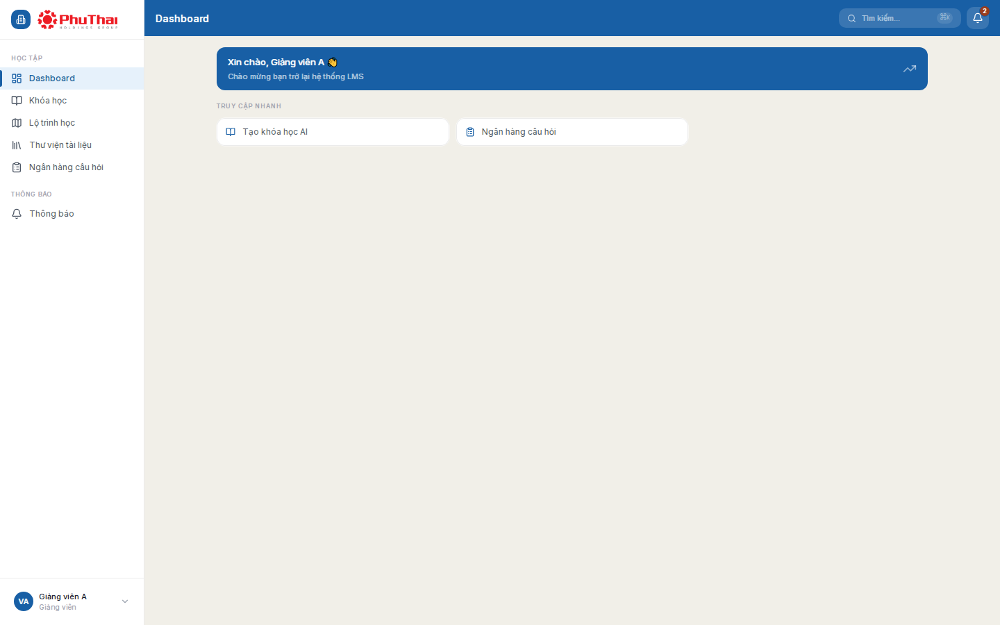


### 2.2 Các thẻ thống kê nhanh (KPI Cards)

Tùy theo vai trò, Dashboard hiển thị các chỉ số khác nhau:

**Với Company Admin / HR Manager:**

| Thẻ | Ý nghĩa |
|---|---|
| **Người dùng** | Tổng số nhân viên trong công ty |
| **Khóa học** | Số khóa học đang có (bao gồm nhận từ tập đoàn) |
| **Lượt đăng ký** | Tổng lượt nhân viên được giao/tự đăng ký khóa học |
| **Tỉ lệ hoàn thành** | % khóa học đã hoàn thành / tổng đăng ký |
| **Tuân thủ bắt buộc** | % nhân viên hoàn thành đúng hạn khóa học bắt buộc |

**Với Group Admin / Group HRM:**

| Thẻ | Ý nghĩa |
|---|---|
| **Công ty** | Số công ty con trong tập đoàn |
| **Người dùng** | Tổng nhân viên toàn tập đoàn |
| **Khóa học** | Tổng khóa học toàn hệ thống |
| **Lượt đăng ký** | Tổng lượt đăng ký toàn tập đoàn |
| **Hoàn thành TB** | Tỉ lệ hoàn thành trung bình giữa các công ty |

### 2.3 Điều hướng từ Dashboard

Thanh menu bên trái gồm các mục:

- **Khóa học** (`/courses`) — Quản lý toàn bộ khóa học
- **Lộ trình học tập** (`/learning-paths`) — Tạo và quản lý lộ trình
- **Nhóm học tập** (`/learning-groups`) — Quản lý nhóm học viên
- **Ngân hàng câu hỏi** (`/question-banks`) — Kho câu hỏi tập trung
- **Khung năng lực** (`/competency-frameworks`) — Cấu trúc năng lực
- **Báo cáo** (`/reports`) — Thống kê và phân tích
- **Người dùng** (`/users`) — Quản lý tài khoản nhân viên

---

## 3. Xây dựng khóa học thủ công

### 3.1 Tạo khóa học mới

**Bước 1:** Truy cập menu **Khóa học** ➔ nhấn nút **Tạo khóa học** (góc trên bên phải màn hình).

> 📸 **[HÌNH 3.1]** Trang danh sách khóa học — nút "Tạo khóa học" màu xanh góc trên phải


**Bước 2:** Hộp thoại tạo khóa học xuất hiện. Điền thông tin:

- **Tên khóa học** *(bắt buộc)*: Nhập tên rõ ràng, phản ánh nội dung.  
  Ví dụ: Nhập `An toàn lao động — Khóa cơ bản 2026`
- **Mô tả** *(tùy chọn)*: Tóm tắt ngắn mục tiêu và đối tượng học viên.  
  Ví dụ: Nhập `Dành cho nhân viên mới, bao gồm các quy trình an toàn cơ bản tại xưởng sản xuất`

**Bước 3:** Nhấn **Tạo** để xác nhận. Hệ thống tạo khóa học ở trạng thái **Bản nháp** và chuyển thẳng vào Course Builder.

> 💡 **Lưu ý:** Tên khóa học có thể chỉnh sửa lại sau trong Course Builder bằng cách nhấn biểu tượng ✎ bên cạnh tiêu đề.

> ⚠️ **Cảnh báo:** Không để trống tên khóa học — hệ thống sẽ báo lỗi và không cho lưu.

**Checklist tạo khóa học:**
- [ ] Tên khóa học đã nhập và không để trống
- [ ] Mô tả phản ánh đúng nội dung (khuyến nghị)
- [ ] Nhấn **Tạo** thành công và chuyển vào Course Builder

---

### 3.2 Giao diện Course Builder — tổng quan

Course Builder là trung tâm quản lý toàn bộ nội dung của một khóa học. Giao diện chia thành các vùng chính:

> 📸 **[HÌNH 3.2]** Giao diện Course Builder đầy đủ — header, 4 tab, danh sách chương/bài học, nút Xuất bản

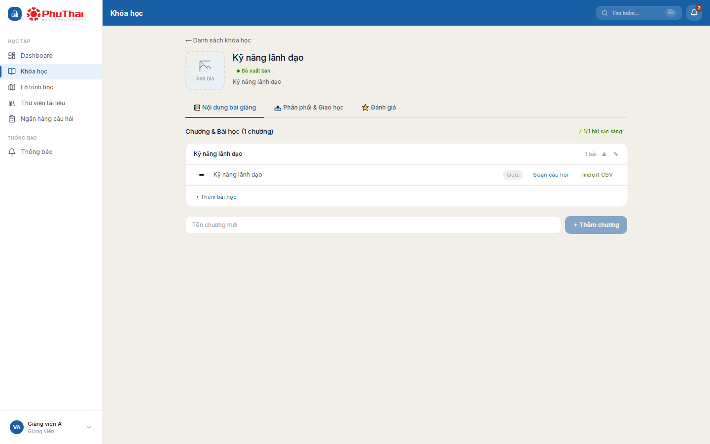


**Vùng Header (đầu trang):**
- **Ảnh bìa** (thumbnail): Ô vuông 80×80px góc trái — nhấn để tải ảnh lên
- **Tên khóa học**: Tiêu đề lớn, nhấn ✎ để sửa inline
- **Trạng thái**: Badge `Bản nháp` (xám) hoặc `Đã xuất bản` (xanh lá)
- **Cấp độ** và **Số giờ học** (nếu đã cài đặt)
- **Nút Xuất bản**: Xuất hiện khi khóa học ở trạng thái Bản nháp và đã sẵn sàng

**Bốn tab chính:**

| Tab | Ký hiệu | Chức năng |
|---|---|---|
| **Nội dung bài giảng** | 📚 | Tạo chương, bài học, upload tài liệu |
| **Phân phối & Giao học** | 📤 | Giao khóa học cho nhóm/phòng ban/cá nhân |
| **Chia sẻ với công ty** | 🔗 | Chia sẻ khóa học cho công ty khác trong tập đoàn (chỉ Group Admin) |
| **Đánh giá** | ⭐ | Xem phản hồi và điểm đánh giá từ học viên |

---

### 3.3 Tạo chương (Section)

Chương là đơn vị tổ chức lớn nhất trong khóa học, gom nhóm các bài học liên quan. Một khóa học nên có từ 3–8 chương.

**Cách tạo chương:**

1. Trong tab **Nội dung bài giảng**, kéo xuống cuối trang đến vùng **Thêm chương mới**.
2. Nhập tên chương vào ô **Tên chương mới**.  
   Ví dụ: Nhập `Chương 1: Giới thiệu quy định an toàn`
3. Nhấn nút **+ Thêm chương** hoặc nhấn phím **Enter**.
4. Chương mới xuất hiện trong danh sách, tự động mở rộng.

> 📸 **[HÌNH 3.3]** Ô nhập tên chương mới ở cuối danh sách — trường text và nút "+ Thêm chương"


> 💡 **Lưu ý:** Thứ tự chương phản ánh đúng thứ tự hiển thị cho học viên. Hãy đặt tên chương theo thứ tự logic: Chương 1, Chương 2, v.v.

> ⚠️ **Cảnh báo:** Nếu ô tên chương để trống, nút **+ Thêm chương** sẽ bị vô hiệu hóa (màu xám) — không thể nhấn được.

**Checklist tạo chương:**
- [ ] Tên chương rõ ràng, phản ánh nội dung tổng thể
- [ ] Thứ tự chương theo logic học tập (từ cơ bản đến nâng cao)
- [ ] Mỗi chương có ít nhất 1 bài học

---

### 3.4 Tạo bài học và chọn loại nội dung

Bài học là đơn vị học tập nhỏ nhất. Mỗi bài học gắn với một loại nội dung cụ thể.

**Cách tạo bài học:**

1. Nhấn vào tiêu đề chương để mở rộng (nếu đang thu lại).
2. Nhấn **+ Thêm bài học** ở cuối danh sách bài học trong chương đó.
3. Form thêm bài học xuất hiện với 2 trường:
   - **Tên bài học**: Nhập tiêu đề bài học.  
     Ví dụ: Nhập `Bài 1.1: Các ký hiệu cảnh báo trong nhà máy`
   - **Loại nội dung**: Chọn từ dropdown

> 📸 **[HÌNH 3.4]** Form thêm bài học — ô nhập tên và dropdown chọn loại nội dung, nút Thêm/Hủy


**Các loại nội dung được hỗ trợ:**

| Biểu tượng | Loại | Mô tả | Định dạng file |
|---|---|---|---|
| ▶ | **Video** | Video giảng dạy, bài giảng quay sẵn | MP4, MOV, AVI |
| 📄 | **PDF** | Tài liệu, slide đã xuất sang PDF | PDF |
| ✏ | **Quiz** | Bài kiểm tra câu hỏi trắc nghiệm | (Soạn trực tiếp trên hệ thống) |
| 📝 | **Văn bản** | Nội dung text HTML, bài đọc | (Soạn trực tiếp trên hệ thống) |
| 📊 | **Trình chiếu** | File slide PowerPoint, Keynote | PPTX, PPT, KEY |
| 🎵 | **Audio** | File âm thanh, podcast, bài giảng audio | MP3, WAV, M4A |

4. Sau khi chọn loại, nhấn **Thêm**. Bài học xuất hiện trong danh sách với trạng thái ban đầu là **✗ Chưa có nội dung**.
5. Lặp lại để thêm các bài học tiếp theo.

**Upload nội dung cho bài học (loại Video/PDF/Audio/Trình chiếu):**

1. Sau khi bài học đã tạo, nhấn nút **Upload nội dung** bên phải tên bài học.
2. Hệ thống chuyển đến trang upload riêng cho bài học đó.
3. Kéo thả file vào vùng upload hoặc nhấn để chọn file từ máy tính.
4. Chờ hệ thống xử lý — trạng thái bài học chuyển sang **⏳ Đang xử lý**.
5. Khi xử lý xong, trạng thái chuyển thành **✓ Sẵn sàng** (màu xanh lá).

> 💡 **Lưu ý:** File video được hệ thống mã hóa và tối ưu tự động sau khi upload. Quá trình này có thể mất vài phút tùy dung lượng file.

**Checklist tạo bài học:**
- [ ] Mỗi bài học có tên rõ ràng và ngắn gọn (dưới 80 ký tự)
- [ ] Đã chọn đúng loại nội dung phù hợp với tài liệu sẵn có
- [ ] Đã upload nội dung hoặc soạn quiz cho mỗi bài học
- [ ] Trạng thái tất cả bài học là ✓ trước khi xuất bản

---

### 3.5 Soạn Quiz cho bài học

Quiz là dạng bài học kiểm tra kiến thức. Bài học Quiz không cần upload file — nội dung được soạn trực tiếp trên hệ thống.

#### Cách 1: Soạn câu hỏi thủ công

1. Tạo bài học với loại **✏ Quiz**.
2. Nhấn nút **Soạn câu hỏi** bên phải tên bài học.

> 📸 **[HÌNH 3.5a]** Bài học Quiz trong danh sách — nút "Soạn câu hỏi" (xanh dương) và "Import CSV" (xanh lá)


3. Trang soạn quiz mở ra. Nhấn **+ Thêm câu hỏi**.
4. Điền thông tin câu hỏi:
   - **Câu hỏi**: Nội dung câu hỏi đầy đủ
   - **Loại**: Chọn `Trắc nghiệm một đáp án`, `Đúng/Sai`, hoặc `Điền vào chỗ trống`
   - **Đáp án A, B, C, D**: Nhập 4 lựa chọn (với loại trắc nghiệm)
   - **Đáp án đúng**: Chọn A, B, C hoặc D
   - **Độ khó**: `Dễ`, `Trung bình`, hoặc `Khó`
   - **Giải thích**: Nội dung giải thích sau khi trả lời (tùy chọn nhưng khuyến khích)
   - **Điểm**: Số điểm cho câu hỏi này (mặc định: 1)
5. Nhấn **Lưu câu hỏi**.

#### Cách 2: Import câu hỏi từ CSV

1. Tại bài học Quiz, nhấn nút **Import CSV**.
2. Hộp thoại Import xuất hiện.
3. Nhấn **↓ Tải file mẫu CSV** để tải template.
4. Mở file mẫu bằng Excel hoặc Google Sheets, điền câu hỏi theo cột:

| Cột | Giá trị hợp lệ | Ví dụ |
|---|---|---|
| `question` | Nội dung câu hỏi | `Màu sắc biển báo nguy hiểm là?` |
| `type` | `single_choice` / `true_false` / `fill_blank` | `single_choice` |
| `option_a` | Đáp án A | `Màu đỏ` |
| `option_b` | Đáp án B | `Màu xanh` |
| `option_c` | Đáp án C | `Màu vàng` |
| `option_d` | Đáp án D | `Màu trắng` |
| `correct_answer` | `A`/`B`/`C`/`D` (single), `true`/`false`, hoặc text | `A` |
| `difficulty` | `easy` / `medium` / `hard` | `medium` |
| `explanation` | Giải thích đáp án | `Biển báo nguy hiểm luôn có viền và nền đỏ` |
| `points` | Số nguyên dương | `1` |

5. Lưu file CSV (UTF-8), quay lại hệ thống.
6. Nhấn **Chọn file CSV đã điền**, chọn file vừa lưu.
7. Nhấn **Import**. Hệ thống thông báo số câu hỏi import thành công.

> ⚠️ **Cảnh báo:** File CSV phải được lưu dưới dạng UTF-8 để tránh lỗi ký tự tiếng Việt. Trong Excel: Lưu dưới dạng ➔ CSV UTF-8 (phân cách bằng dấu phẩy).

> 💡 **Lưu ý:** Với câu hỏi `true_false`, chỉ cần điền `option_a` = `Đúng`, `option_b` = `Sai`, bỏ trống `option_c` và `option_d`. `correct_answer` điền `true` hoặc `false`.

**Checklist soạn Quiz:**
- [ ] Mỗi quiz có ít nhất 5 câu hỏi
- [ ] Đa dạng độ khó: kết hợp Dễ/Trung bình/Khó
- [ ] Tất cả câu hỏi đều có đáp án đúng được chỉ định
- [ ] Nên có phần giải thích cho các câu hỏi quan trọng

---

### 3.6 Upload thumbnail khóa học

Ảnh bìa (thumbnail) giúp học viên nhận diện khóa học dễ dàng trong danh sách.

1. Trong Course Builder, nhìn vào **header** — phía trái tiêu đề khóa học là ô vuông **Ảnh bìa** (80×80px).
2. Nếu chưa có ảnh: ô hiển thị biểu tượng hình ảnh và chữ **Ảnh bìa**.
3. Nhấn vào ô vuông đó.
4. Hộp thoại chọn file mở ra. Chọn file ảnh từ máy tính.
   - Định dạng hỗ trợ: **JPEG, PNG, WebP, GIF**
   - Khuyến nghị kích thước: **800×450px** (tỉ lệ 16:9) hoặc **600×600px** (tỉ lệ 1:1)
5. Hệ thống tự động upload và hiển thị ảnh mới trong ô thumbnail.
6. Thông báo **"Đã cập nhật ảnh bìa khóa học"** xuất hiện ở góc màn hình.

> 📸 **[HÌNH 3.6]** Ô thumbnail — trạng thái chưa có ảnh (trái) và đã có ảnh với overlay "Đổi ảnh" khi hover (phải)


**Để thay ảnh bìa:** Di chuột vào ảnh — xuất hiện overlay tối với chữ **"Đổi ảnh"** — nhấn để chọn ảnh mới.

> 💡 **Lưu ý:** Nên dùng ảnh có độ tương phản cao, chữ (nếu có) đủ lớn để đọc được ở kích thước thumbnail nhỏ.

---

### 3.7 Chỉnh sửa tên chương/bài học inline

Hệ thống hỗ trợ chỉnh sửa tên trực tiếp mà không cần mở popup riêng.

#### Sửa tên chương:

1. Di chuột vào hàng tiêu đề chương — biểu tượng ✎ xuất hiện bên phải.
2. Nhấn ✎.
3. Ô text xuất hiện thay thế tiêu đề, chứa tên hiện tại.
4. Chỉnh sửa nội dung.
5. Nhấn **Lưu** hoặc nhấn phím **Enter** để lưu / nhấn **Hủy** hoặc phím **Esc** để hủy.

#### Sửa tên bài học:

1. Di chuột vào hàng bài học — biểu tượng ✎ xuất hiện bên phải (chỉ hiển thị khi hover).
2. Nhấn ✎.
3. Ô text xuất hiện.
4. Chỉnh sửa tên bài học.
5. Nhấn **Lưu** hoặc **Enter** để lưu.

#### Sửa tên khóa học:

1. Di chuột vào tiêu đề khóa học lớn ở header.
2. Biểu tượng ✎ xuất hiện bên phải tiêu đề.
3. Nhấn ✎ — tiêu đề chuyển thành ô nhập liệu với đường gạch dưới màu xanh.
4. Chỉnh sửa, nhấn **Lưu** hoặc **Enter**.

> 📸 **[HÌNH 3.7]** Chế độ sửa inline của tên chương — ô text, nút Lưu và Hủy


---

### 3.8 Thanh trạng thái bài học

Mỗi bài học có một chỉ báo trạng thái hiển thị ở phía phải tên bài học (áp dụng cho các loại cần file: Video, PDF, Audio, Trình chiếu):

| Ký hiệu | Màu | Trạng thái | Ý nghĩa |
|---|---|---|---|
| **✓** | Xanh lá | **Sẵn sàng (Ready)** | Nội dung đã upload và xử lý xong |
| **⏳** | Vàng cam | **Đang xử lý (Processing)** | Hệ thống đang mã hóa/xử lý file |
| **✗** | Đỏ | **Chưa sẵn sàng (Not Ready)** | Chưa có file hoặc xử lý thất bại |

> 📸 **[HÌNH 3.8]** Danh sách bài học — các trạng thái ✓ (xanh), ⏳ (vàng), ✗ (đỏ) bên phải tên bài học


**Thanh tổng hợp trạng thái** (góc trên phải vùng danh sách bài học) hiển thị tổng số:
- `✓ 5/8 bài sẵn sàng` — màu xanh lá
- `⏳ 5/8 sẵn sàng · 2 đang xử lý` — màu vàng cam
- `✗ 3/8 bài sẵn sàng` — màu đỏ

> ⚠️ **Cảnh báo:** Khóa học chỉ có thể xuất bản khi **tất cả bài học** ở trạng thái ✓ Sẵn sàng. Bài học Quiz không cần file nhưng phải có ít nhất 1 câu hỏi.

**Khi bài học ở trạng thái ✗**, di chuột vào biểu tượng để xem lý do cụ thể (ví dụ: `Chưa có file nội dung`, `File xử lý thất bại`).

---

### 3.9 Xuất bản khóa học

Xuất bản là bước chuyển khóa học từ trạng thái **Bản nháp** sang **Đã xuất bản**, cho phép phân phối đến học viên.

**Điều kiện tiên quyết để xuất bản:**
- Khóa học có ít nhất 1 chương
- Mỗi chương có ít nhất 1 bài học
- Tất cả bài học có trạng thái ✓ Sẵn sàng

**Quy trình xuất bản:**

1. Trong Course Builder, kiểm tra vùng cảnh báo (nếu có) ở góc trên phải:
   - `⏳ X bài đang xử lý` — chờ xử lý xong
   - `✗ X bài chưa có nội dung` — upload nội dung trước
2. Khi tất cả bài học sẵn sàng, nút **✓ Xuất bản** màu xanh lá xuất hiện.
3. Nhấn **✓ Xuất bản** lần đầu — hệ thống hỏi xác nhận:
   > `Xuất bản khóa học?` — hiển thị nút **Xác nhận** và **Hủy**
4. Nhấn **Xác nhận** để hoàn tất.
5. Thông báo **"Xuất bản khóa học thành công!"** xuất hiện.
6. Badge trạng thái đổi sang `● Đã xuất bản` màu xanh lá.

> 📸 **[HÌNH 3.9]** Trạng thái xác nhận xuất bản — nút Xác nhận và Hủy cạnh nhau


> ⚠️ **Cảnh báo:** Sau khi xuất bản, khóa học **không thể quay lại trạng thái Bản nháp** một cách tự động. Hãy đảm bảo nội dung đã hoàn chỉnh trước khi xuất bản.

> 💡 **Lưu ý:** Xuất bản không tự động giao khóa học cho học viên. Bạn vẫn cần thực hiện bước **Phân phối** (xem Mục 6).

**Checklist trước khi xuất bản:**
- [ ] Tên khóa học chính xác và không có lỗi chính tả
- [ ] Ảnh bìa đã được upload
- [ ] Tất cả chương có tiêu đề rõ ràng
- [ ] Tất cả bài học ở trạng thái ✓ Sẵn sàng
- [ ] Quiz có đủ câu hỏi (ít nhất 5 câu/quiz)
- [ ] Mô tả khóa học đã điền đầy đủ

---

## 4. Xây dựng khóa học với AI (Course Wizard)

Course Wizard là tính năng sử dụng trí tuệ nhân tạo để hỗ trợ tạo cấu trúc khóa học, nội dung bài giảng và câu hỏi quiz tự động. Phù hợp khi cần tạo khóa học mới nhanh chóng hoặc khi chưa có sẵn tài liệu.

**Truy cập:** Menu **Khóa học** ➔ nút **AI Course Wizard** (hoặc truy cập trực tiếp `/courses/wizard`).

> 📸 **[HÌNH 4.0]** Giao diện Course Wizard — thanh tiến trình 5 bước ở đầu trang

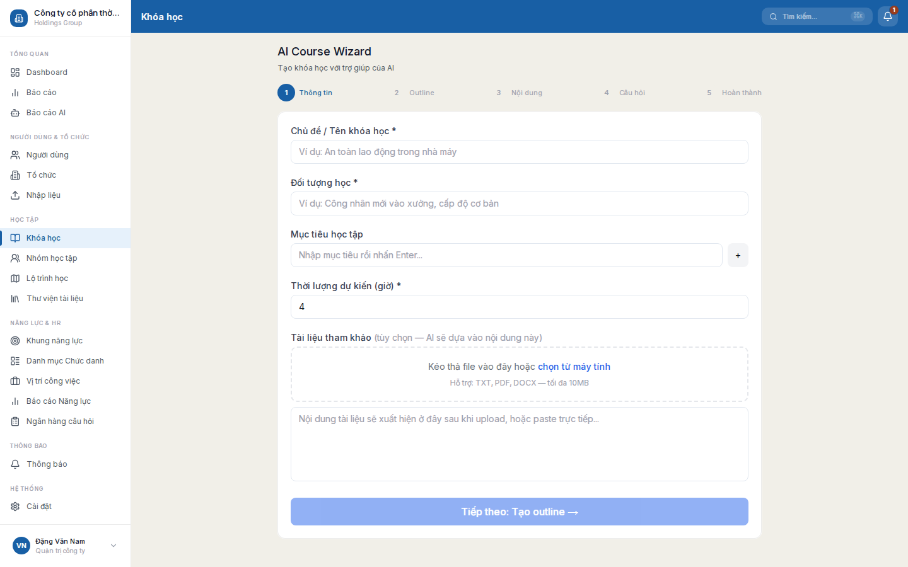


**Thanh tiến trình (Stepper):** Hiển thị 5 bước:
`① Thông tin` → `② Outline` → `③ Nội dung` → `④ Câu hỏi` → `⑤ Hoàn thành`

Bước đã hoàn thành hiển thị màu xanh lá với ký hiệu ✓. Bước hiện tại màu xanh dương. Bước chưa đến màu xám.

---

### 4.1 Bước 1 — Thông tin khóa học

**Mục tiêu:** Cung cấp thông tin đầu vào để AI tạo outline phù hợp.

> 📸 **[HÌNH 4.1]** Bước 1 — Form nhập thông tin: chủ đề, đối tượng, mục tiêu học tập, số giờ


**Điền các trường sau:**

1. **Chủ đề khóa học** *(bắt buộc)*:  
   Mô tả ngắn gọn nội dung chính của khóa học.  
   Ví dụ: Nhập `Kỹ năng giao tiếp hiệu quả trong môi trường doanh nghiệp`

2. **Đối tượng học viên** *(bắt buộc)*:  
   Mô tả ai sẽ học khóa học này.  
   Ví dụ: Nhập `Nhân viên mới dưới 1 năm kinh nghiệm, ở các bộ phận kinh doanh và chăm sóc khách hàng`

3. **Mục tiêu học tập**:  
   Nhấn **+ Thêm mục tiêu** để thêm từng mục tiêu cụ thể.  
   Ví dụ: Thêm `Học viên có thể viết email chuyên nghiệp`, `Học viên xử lý được phản hồi khách hàng khó`  
   Nhấn nút **×** bên cạnh để xóa mục tiêu không cần.

4. **Thời lượng khóa học (giờ)**:  
   Nhập số giờ ước tính hoàn thành.  
   Ví dụ: Nhập `4` cho khóa học 4 giờ

5. Nhấn **Tiếp theo →**. Hệ thống gọi AI để tạo outline và chuyển sang Bước 2.

> 💡 **Lưu ý:** AI tạo outline chất lượng tốt hơn khi mục tiêu học tập được mô tả cụ thể, đo lường được. Tránh dùng mục tiêu chung chung như "Hiểu về giao tiếp".

---

### 4.2 Bước 2 — Xem và chỉnh sửa Outline

**Mục tiêu:** Xem lại cấu trúc do AI đề xuất và chỉnh sửa trước khi tạo nội dung.

> 📸 **[HÌNH 4.2]** Bước 2 — Danh sách chương/bài AI đề xuất, nút "Tạo lại" và thanh điều hướng

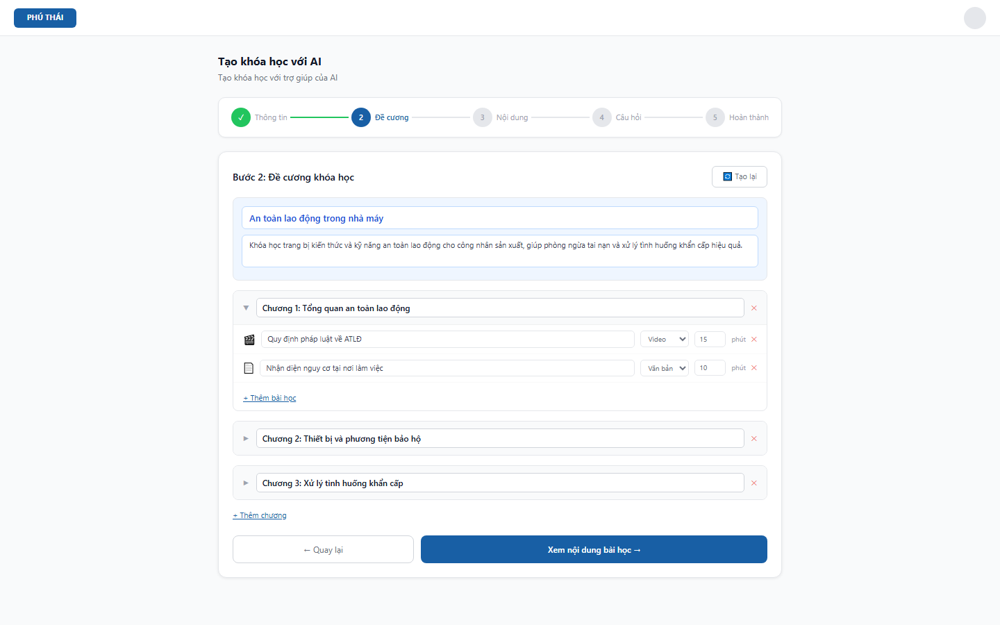


Outline gồm danh sách các chương (**Section**) và bài học (**Lesson**) mà AI đề xuất.

**Các thao tác có thể thực hiện:**

- **Xem outline**: Đọc qua các chương và bài học đã được đề xuất.
- **Chỉnh sửa tên chương/bài học**: Nhấn vào tên để sửa trực tiếp.
- **Tạo lại outline**: Nhấn nút **Tạo lại** nếu kết quả không phù hợp — AI sẽ tạo lại dựa trên thông tin Bước 1. Lưu ý các chỉnh sửa thủ công sẽ bị mất.
- **Điều chỉnh thứ tự**: Kéo thả các bài học để sắp xếp lại nếu cần.

Khi đã hài lòng với cấu trúc, nhấn **Tiếp theo →** để sang Bước 3.

> 💡 **Lưu ý:** Outline từ AI thường có 3–5 chương và 10–20 bài học tùy theo thời lượng đã nhập. Bạn có thể giữ nguyên hoặc tinh chỉnh — khóa học vẫn có thể chỉnh sửa thêm sau trong Course Builder.

---

### 4.3 Bước 3 — Duyệt nội dung bài giảng

**Mục tiêu:** AI tạo tóm tắt/script nội dung cho từng bài học để bạn xem trước và duyệt.

> 📸 **[HÌNH 4.3]** Bước 3 — Danh sách bài học với nội dung tóm tắt do AI tạo, thanh tiến trình

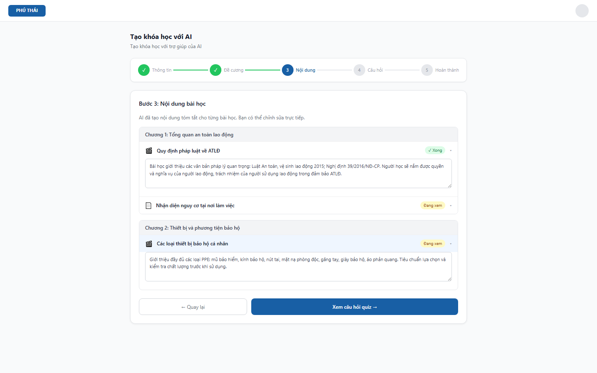


Trang hiển thị từng bài học trong outline. Với mỗi bài học:
- Hệ thống tự động gọi AI để tạo **nội dung tóm tắt/script** (vài đoạn văn mô tả nội dung)
- Bài đang tạo hiển thị vòng xoay loading
- Bài đã tạo xong hiển thị nội dung đầy đủ

**Lưu ý quan trọng:** Nội dung AI tạo ở bước này chỉ là **đề cương tham khảo** — không tự động trở thành nội dung bài học. Sau khi hoàn thành Wizard, bạn vẫn cần upload video/PDF thực tế vào từng bài học trong Course Builder.

Khi đã xem qua, nhấn **Tiếp theo →**.

---

### 4.4 Bước 4 — Xem trước câu hỏi Quiz

**Mục tiêu:** AI tạo bộ câu hỏi quiz dựa trên nội dung outline — xem trước và chọn lọc câu hỏi muốn giữ lại.

> 📸 **[HÌNH 4.4]** Bước 4 — Danh sách câu hỏi do AI tạo, mỗi câu có checkbox để chọn/bỏ chọn

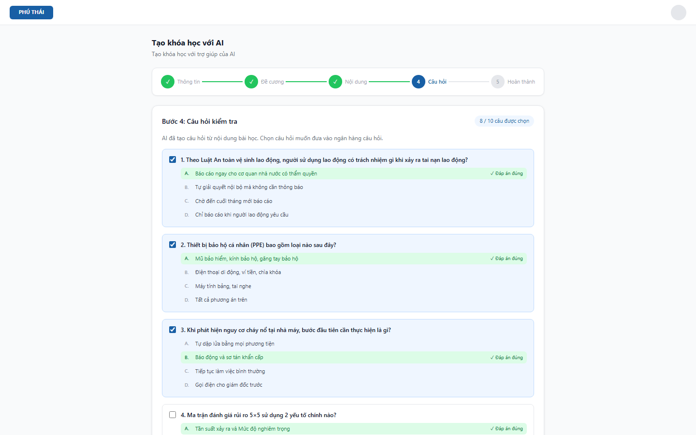


Danh sách câu hỏi trắc nghiệm do AI đề xuất hiển thị với:
- Nội dung câu hỏi
- 4 đáp án (A, B, C, D)
- Đáp án đúng được đánh dấu
- Độ khó

**Thao tác:**
- **Chọn câu hỏi** để giữ lại: Tích vào checkbox bên trái câu hỏi
- **Bỏ chọn** những câu không phù hợp
- Câu hỏi được chọn sẽ được thêm vào **Ngân hàng câu hỏi** ở trạng thái **Chờ duyệt**

Nhấn **Hoàn thành** để tạo khóa học.

> 💡 **Lưu ý:** Câu hỏi AI tạo cần được duyệt trong **Ngân hàng câu hỏi** (tab **Chờ duyệt**) trước khi sử dụng chính thức. Xem Mục 5.5 để biết cách duyệt.

---

### 4.5 Bước 5 — Hoàn thành

> 📸 **[HÌNH 4.5]** Bước 5 — Thông báo 🎉 "Khóa học đã được tạo!", số câu hỏi đã thêm, nút "Vào Course Builder"

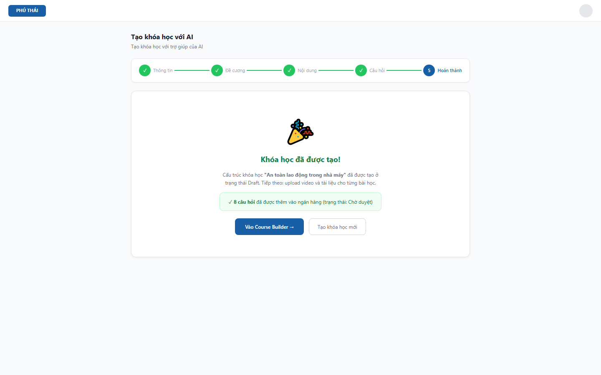


Hệ thống hiển thị thông báo thành công:
- **"Khóa học đã được tạo!"** (chữ xanh lá)
- Thông tin: `Cấu trúc khóa học đã được tạo ở trạng thái Draft. Tiếp theo: upload video/tài liệu cho từng bài học.`
- Số câu hỏi đã thêm vào ngân hàng (nếu có chọn ở Bước 4)

**Hai lựa chọn tiếp theo:**
- Nhấn **Vào Course Builder →** để tiến hành upload nội dung cho từng bài học
- Nhấn **Tạo khóa học mới** để bắt đầu lại quy trình Wizard cho khóa học khác

**Checklist sau khi dùng Course Wizard:**
- [ ] Đã vào Course Builder và kiểm tra cấu trúc chương/bài đã tạo
- [ ] Upload nội dung (video/PDF) cho từng bài học phù hợp
- [ ] Vào Ngân hàng câu hỏi ➔ tab Chờ duyệt để duyệt câu hỏi AI
- [ ] Xuất bản khóa học khi tất cả bài học ở trạng thái ✓

---

## 5. Ngân hàng câu hỏi

Ngân hàng câu hỏi là kho lưu trữ tập trung tất cả câu hỏi của công ty, có thể tái sử dụng trong nhiều khóa học và quiz.

**Truy cập:** Menu **Ngân hàng câu hỏi** ➔ Chọn ngân hàng cụ thể.

### 5.1 Truy cập và tổng quan

> 📸 **[HÌNH 5.1]** Trang danh sách ngân hàng câu hỏi — các card ngân hàng với tên, số câu, nút truy cập

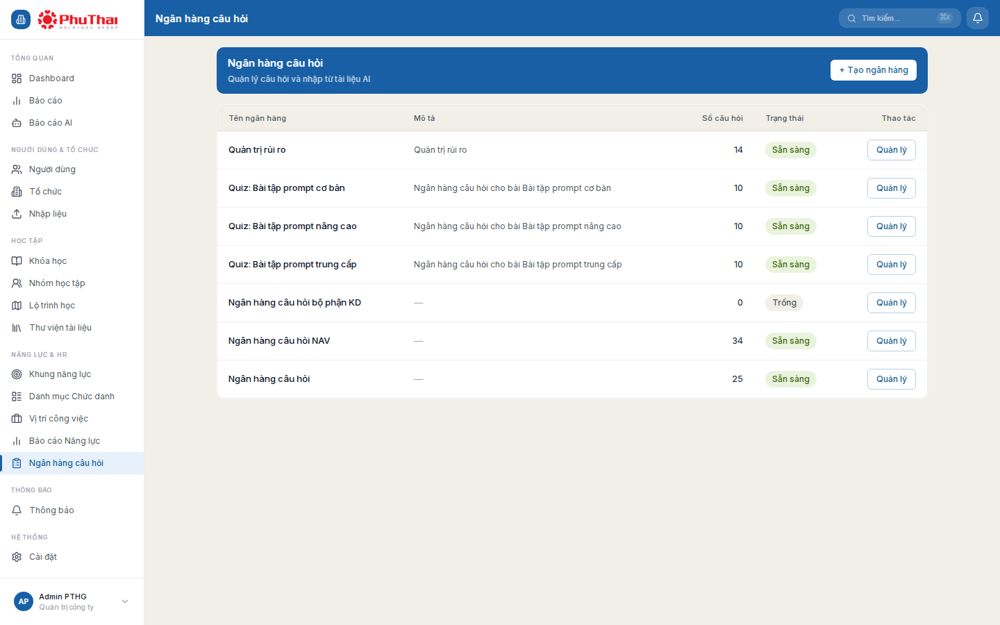


Trang ngân hàng câu hỏi chi tiết gồm 4 tab:

| Tab | Chức năng |
|---|---|
| **Tất cả câu hỏi** | Danh sách toàn bộ câu hỏi đã được duyệt |
| **Chờ duyệt** | Câu hỏi do AI tạo, chưa được kiểm tra |
| **Tạo mới** | Form soạn câu hỏi thủ công |
| **Danh mục năng lực** | Quản lý danh mục phân loại câu hỏi |

**Các nút chức năng ở header:**
- **↓ Mẫu CSV** — Tải file template để import hàng loạt
- **📥 Import CSV** — Import câu hỏi từ file CSV
- **🤖 Nhập từ tài liệu AI** — Upload tài liệu để AI trích xuất câu hỏi
- **+ Thêm câu hỏi** — Soạn câu hỏi thủ công

---

### 5.2 Tạo câu hỏi thủ công

1. Nhấn **+ Thêm câu hỏi** hoặc nhấn tab **Tạo mới**.
2. Điền form câu hỏi:

> 📸 **[HÌNH 5.2]** Form tạo câu hỏi — dropdown loại, ô nhập câu hỏi, 4 đáp án, độ khó, giải thích

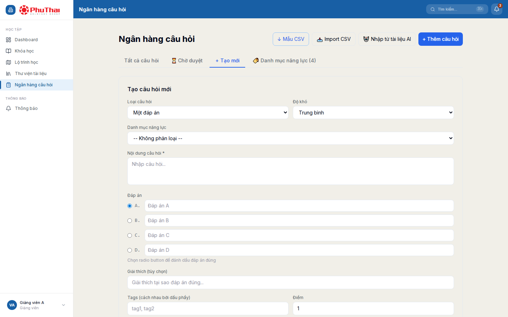


**Các trường cần điền:**

| Trường | Mô tả | Ví dụ |
|---|---|---|
| **Loại câu hỏi** | Trắc nghiệm / Đúng-Sai / Điền chỗ trống | `Trắc nghiệm một đáp án` |
| **Nội dung câu hỏi** | Câu hỏi đầy đủ | `Thời gian thử việc tối đa theo luật lao động VN là bao nhiêu?` |
| **Đáp án A** | Lựa chọn thứ nhất | `30 ngày` |
| **Đáp án B** | Lựa chọn thứ hai | `60 ngày` |
| **Đáp án C** | Lựa chọn thứ ba | `90 ngày` |
| **Đáp án D** | Lựa chọn thứ tư | `180 ngày` |
| **Đáp án đúng** | Chọn A/B/C/D | `B` |
| **Độ khó** | Dễ / Trung bình / Khó | `Trung bình` |
| **Giải thích** | Lý do đáp án đúng | `Theo Bộ luật Lao động 2019, thời gian thử việc tối đa là 60 ngày với công việc có chuyên môn kỹ thuật cao` |
| **Điểm** | Số điểm câu hỏi | `1` |
| **Danh mục** | Phân loại năng lực | `Luật lao động` |

3. Nhấn **Lưu câu hỏi**. Câu hỏi xuất hiện trong tab **Tất cả câu hỏi**.

---

### 5.3 Import câu hỏi từ file CSV

Import hàng loạt câu hỏi phù hợp khi có sẵn ngân hàng câu hỏi từ hệ thống cũ hoặc file Excel.

1. Nhấn **↓ Mẫu CSV** để tải file template.
2. Mở file template, điền câu hỏi vào các cột (xem bảng định dạng tại Phụ lục B).
3. Lưu file dưới dạng `.csv` mã hóa **UTF-8**.
4. Nhấn **📥 Import CSV**.
5. Hộp thoại import xuất hiện:
   - Nhấn **Chọn file** và chọn file CSV đã chuẩn bị
   - Tùy chọn: Chọn **Danh mục mặc định** để gán toàn bộ câu hỏi vào một danh mục
6. Nhấn **Import**.
7. Hệ thống báo kết quả: `Import thành công X câu hỏi`.

> ⚠️ **Cảnh báo:** Nếu có lỗi, hệ thống hiển thị danh sách dòng bị lỗi (tối đa 3 dòng đầu). Sửa lỗi trong file CSV rồi import lại — hệ thống không tự bỏ qua dòng lỗi.

---

### 5.4 Nhập câu hỏi từ tài liệu bằng AI

Tính năng này cho phép upload tài liệu đào tạo (PDF, Word) và AI tự động trích xuất câu hỏi phù hợp.

1. Nhấn **🤖 Nhập từ tài liệu AI**.
2. Hộp thoại Import Document Modal xuất hiện.
3. Upload file tài liệu (PDF hoặc DOCX).
4. Nhấn **Xử lý**. AI phân tích tài liệu và tạo danh sách câu hỏi.
5. Xem kết quả và chọn câu hỏi muốn thêm vào ngân hàng.
6. Câu hỏi được thêm vào tab **Chờ duyệt**.

> 💡 **Lưu ý:** Chất lượng câu hỏi phụ thuộc vào độ rõ ràng của tài liệu. Tài liệu có cấu trúc rõ ràng (tiêu đề, đầu mục) cho kết quả tốt hơn tài liệu dạng văn xuôi liên tục.

---

### 5.5 Duyệt câu hỏi do AI tạo

Câu hỏi từ AI (Wizard hoặc Import Document) được đặt vào trạng thái **Chờ duyệt** — cần người có thẩm quyền xem xét trước khi sử dụng.

1. Vào tab **Chờ duyệt**.
2. Danh sách câu hỏi chờ duyệt hiển thị với nội dung đầy đủ.
3. Với mỗi câu hỏi:
   - **Duyệt (Approve)**: Câu hỏi chuyển sang tab **Tất cả câu hỏi**, sẵn sàng sử dụng
   - **Từ chối (Reject)**: Câu hỏi bị xóa khỏi hàng chờ
   - **Sửa rồi duyệt**: Nhấn biểu tượng chỉnh sửa, điều chỉnh nội dung, rồi duyệt

> 📸 **[HÌNH 5.5]** Tab "Chờ duyệt" — danh sách câu hỏi AI, nút Duyệt và Từ chối

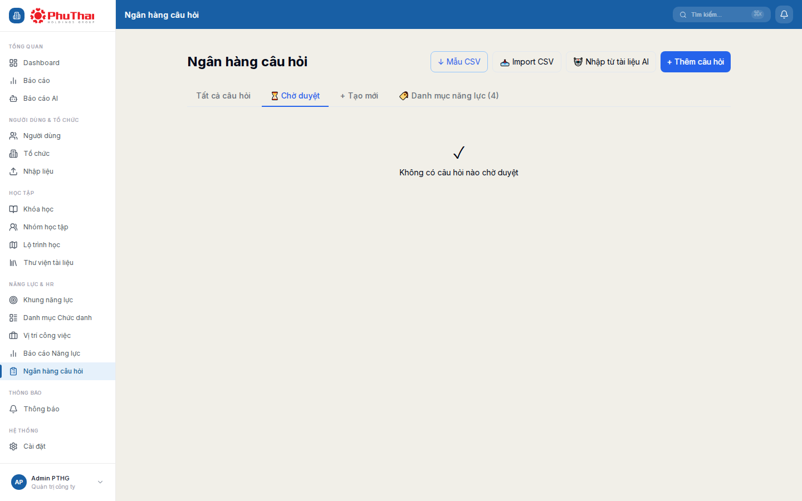


> ⚠️ **Cảnh báo:** Không duyệt câu hỏi AI mà không đọc kỹ. AI có thể tạo câu hỏi có đáp án sai hoặc không phù hợp với bối cảnh công ty. Mọi câu hỏi đã duyệt cần đảm bảo tính chính xác về nghiệp vụ.

---

### 5.6 Quản lý danh mục năng lực

Danh mục giúp phân loại câu hỏi theo chủ đề hoặc năng lực, dễ tìm kiếm và lọc khi soạn quiz.

**Tạo danh mục mới:**

1. Vào tab **Danh mục năng lực**.
2. Nhấn **+ Tạo danh mục**.
3. Điền:
   - **Tên danh mục**: Ví dụ: `An toàn lao động`, `Kỹ năng mềm`, `Luật và quy định`
   - **Mô tả**: Giải thích ngắn phạm vi của danh mục
   - **Màu sắc**: Chọn màu nhận diện từ bảng màu có sẵn (8 màu)
   - **Liên kết năng lực**: Gắn với năng lực trong Khung năng lực (tùy chọn)
4. Nhấn **Lưu**.

> 📸 **[HÌNH 5.6]** Tab "Danh mục năng lực" — card danh mục với chấm màu, tên, mô tả, số câu hỏi, nút Sửa/Xóa

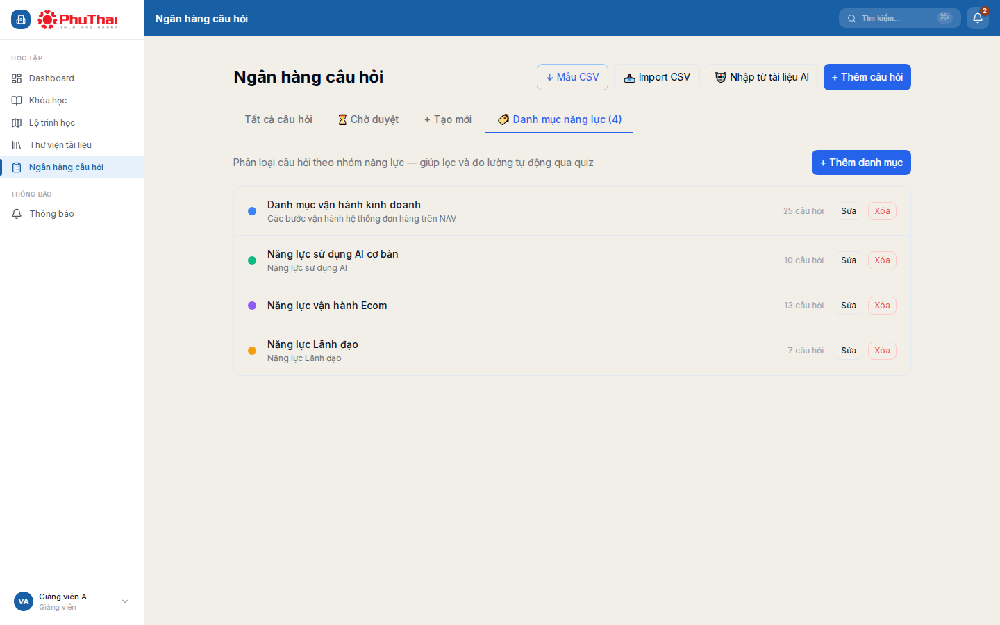


**Chỉnh sửa danh mục:** Nhấn biểu tượng **Sửa** trên card danh mục.

**Xóa danh mục:** Chỉ xóa được danh mục **không có câu hỏi nào** (`questionCount = 0`). Nếu danh mục đang có câu hỏi, hệ thống hiển thị thông báo lỗi và không cho xóa.

---

### 5.7 Xóa và chỉnh sửa câu hỏi

**Chỉnh sửa câu hỏi:**

1. Trong tab **Tất cả câu hỏi**, tìm câu hỏi cần sửa.
2. Nhấn biểu tượng **Sửa** (✏) bên phải.
3. Form chỉnh sửa mở ra với dữ liệu hiện tại.
4. Điều chỉnh và nhấn **Lưu**.

**Lọc câu hỏi:** Sử dụng bộ lọc trên danh sách:
- Lọc theo **Loại**: Trắc nghiệm / Đúng-Sai / Điền chỗ trống
- Lọc theo **Độ khó**: Dễ / Trung bình / Khó
- Lọc theo **Danh mục**: Chọn danh mục từ dropdown
- Lọc theo **Tag**: Nhập từ khóa

---

## 6. Phân phối khóa học (Tab Assign)

### 6.1 Tổng quan luồng phân phối

Sau khi khóa học được xuất bản, bạn cần chủ động **phân phối** (giao) đến học viên. Có 3 cơ chế phân phối chính:

| Cơ chế | Phù hợp khi | Ai thực hiện |
|---|---|---|
| **Nhóm học tập** | Giao cho nhóm liên công ty | Group Admin / Group HRM |
| **Phòng ban** | Giao cho toàn bộ một phòng/ban hoặc cả công ty | Company Admin / HR Manager |
| **Cá nhân** | Giao trực tiếp cho từng nhân viên | Company Admin / HR Manager / Group Admin |

**Truy cập:** Trong Course Builder ➔ Tab **📤 Phân phối & Giao học**.

> ⚠️ **Cảnh báo:** Nếu khóa học chưa được xuất bản, tab Phân phối hiển thị cảnh báo vàng và nút **Giao khóa học** bị vô hiệu hóa. Phải xuất bản trước.

---

### 6.2 Giao cho Nhóm học tập

1. Trong tab **📤 Phân phối & Giao học**, nhấn nút **👥 Nhóm học tập**.
2. Trường **Nhóm học tập** (bắt buộc): Chọn nhóm từ dropdown.  
   Ví dụ: Chọn `Nhóm Kỹ sư khu vực miền Bắc (Tự động)`
3. Trường **Hạn hoàn thành** (tùy chọn): Chọn ngày từ date picker.  
   Ví dụ: Chọn `31/12/2026`
4. Nhấn nút **📤 Giao khóa học**.
5. Thông báo `✓ Đã giao khóa học cho nhóm học tập!` xuất hiện.

> 💡 **Lưu ý:** Nếu chưa có nhóm nào, hệ thống hiển thị link `Tạo nhóm` dẫn đến trang Nhóm học tập. Xem Mục 8 để biết cách tạo nhóm.

---

### 6.3 Giao cho Phòng ban

1. Nhấn nút **🏢 Phòng ban**.
2. Trường **Phòng ban**: Chọn phòng ban cụ thể hoặc chọn `— Toàn bộ công ty —` để giao cho tất cả nhân viên.  
   Ví dụ: Chọn `Phòng Sản xuất` để chỉ giao cho bộ phận sản xuất
3. Trường **Hạn hoàn thành**: Chọn ngày deadline.
4. **Bắt buộc** (checkbox): Tích chọn nếu đây là khóa học bắt buộc phải hoàn thành.
5. Nhấn **📤 Giao khóa học**.

> 💡 **Lưu ý:** Khi giao cho toàn bộ công ty (bỏ trống phòng ban), **tất cả nhân viên** trong hệ thống sẽ thấy khóa học này trong "Khóa học của tôi". Cân nhắc kỹ trước khi thực hiện.

---

### 6.4 Giao cho Cá nhân

1. Nhấn nút **👤 Cá nhân**.
2. Trường **Người dùng** (bắt buộc): Chọn nhân viên từ dropdown (hiển thị họ tên và email).  
   Ví dụ: Chọn `Nguyễn Văn An (an.nguyen@company.vn)`
3. Trường **Hạn hoàn thành**: Chọn ngày.
4. **Bắt buộc**: Tích nếu cần.
5. Nhấn **📤 Giao khóa học**.

> 💡 **Lưu ý:** Giao cá nhân phù hợp cho các trường hợp đào tạo bổ sung, nhân viên mới chưa vào nhóm, hoặc đào tạo phát triển cá nhân theo kế hoạch riêng.

---

### 6.5 Xem lịch sử giao học

Phía dưới form phân phối là **Lịch sử giao học** — danh sách tất cả lần giao khóa học này.

> 📸 **[HÌNH 6.5]** Lịch sử giao học — mỗi dòng có chấm màu theo loại, tên đối tượng, badge loại (Cá nhân/Phòng ban/Công ty), badge Bắt buộc, người giao, ngày giao, hạn hoàn thành

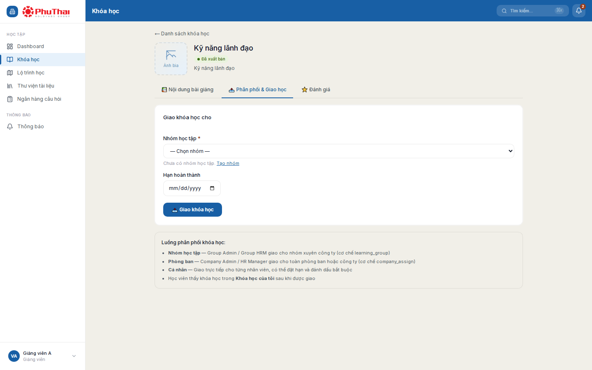


Mỗi mục lịch sử hiển thị:
- **Chấm màu**: Xanh dương (Cá nhân) / Xanh lá (Phòng ban) / Vàng (Công ty/Nhóm)
- **Tên đối tượng nhận**: Tên nhân viên, phòng ban, hoặc nhóm
- **Badge loại**: `Cá nhân`, `Phòng ban`, `Công ty`
- **Badge "Bắt buộc"** (đỏ): Chỉ hiển thị nếu đã đánh dấu bắt buộc
- **Người giao** và **Ngày giao**
- **Hạn hoàn thành** (nếu có)

---

### 6.6 Chia sẻ khóa học với công ty khác (Group Admin)

Tab này chỉ hiển thị với vai trò **Group Admin** hoặc **Group HRM**, cho phép chia sẻ khóa học do công ty mình tạo với các công ty con khác trong tập đoàn.

1. Vào tab **🔗 Chia sẻ với công ty**.
2. Danh sách công ty trong tập đoàn hiển thị dưới dạng checklist.
   - Công ty **Đã chia sẻ**: Checkbox đã tích, nền xám, không thể bỏ chọn ở đây (dùng Thu hồi)
   - Công ty **Chưa chia sẻ**: Checkbox trống, nền trắng, có thể chọn
3. Nhấn **Chọn tất cả** để chọn nhanh tất cả công ty chưa được chia sẻ, hoặc tích từng ô theo nhu cầu.
4. **Hạn hoàn thành** (tùy chọn): Thiết lập deadline cho toàn bộ công ty được chọn.
5. **Bắt buộc học**: Tích nếu muốn đánh dấu bắt buộc với tất cả công ty được chọn.
6. Nhấn **🔗 Chia sẻ với X công ty đã chọn**.
7. Thông báo `Đã chia sẻ khóa học với X công ty` xuất hiện.

> 📸 **[HÌNH 6.6]** Tab Chia sẻ — checklist công ty, nút "Chọn tất cả", deadline, checkbox bắt buộc, nút Chia sẻ

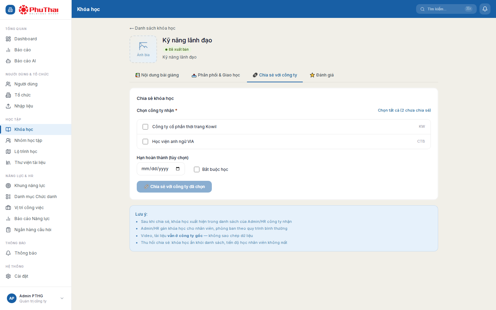

> 💡 **Lưu ý sau khi chia sẻ:**
> - Khóa học xuất hiện trong danh sách của Admin/HR công ty nhận
> - Video và tài liệu **không được sao chép** — vẫn lưu ở công ty gốc
> - Admin/HR công ty nhận tự giao cho nhân viên theo quy trình bình thường

---

### 6.7 Thu hồi chia sẻ

1. Trong tab **🔗 Chia sẻ với công ty**, xem phần **"Đang chia sẻ với (X công ty)"**.
2. Tìm công ty cần thu hồi.
3. Nhấn nút **Thu hồi** (màu đỏ) bên phải tên công ty.
4. Thông báo `Đã thu hồi chia sẻ` xuất hiện.

> ⚠️ **Cảnh báo:** Thu hồi chia sẻ làm khóa học **biến mất** khỏi danh sách của công ty nhận. Tuy nhiên, **tiến độ học của nhân viên không bị mất** — dữ liệu vẫn được lưu trong hệ thống. Nếu chia sẻ lại, nhân viên tiếp tục từ điểm đã học.

---

## 7. Lộ trình học tập

Lộ trình học tập (Learning Path) là chuỗi các khóa học được sắp xếp theo thứ tự, giúp học viên phát triển năng lực theo lộ trình bài bản.

**Truy cập:** Menu **Lộ trình học tập** ➔ chọn lộ trình cụ thể.

### 7.1 Tạo lộ trình mới

1. Vào trang **Lộ trình học tập**.
2. Nhấn **+ Tạo lộ trình**.
3. Điền:
   - **Tên lộ trình**: Ví dụ: `Lộ trình Phát triển Kỹ sư Junior → Senior`
   - **Mô tả**: Mục tiêu và đối tượng của lộ trình
   - **Thời gian hoàn thành (ngày)** (tùy chọn): Tổng thời gian dự kiến hoàn thành toàn lộ trình
4. Nhấn **Tạo**. Hệ thống chuyển vào trang chi tiết lộ trình (Learning Path Builder).

> 📸 **[HÌNH 7.1]** Trang Learning Path Builder — header với tên lộ trình, danh sách bước học, form thêm bước

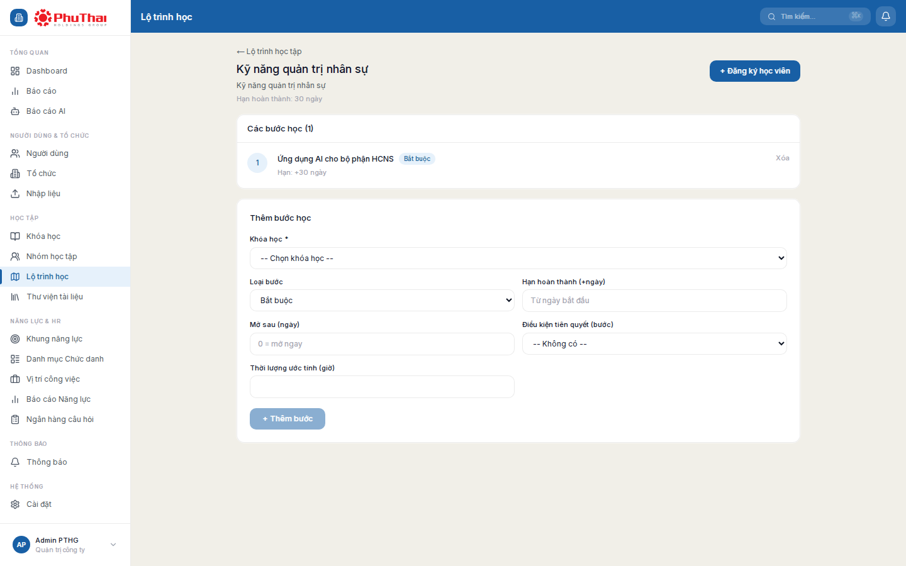


---

### 7.2 Thêm bước học vào lộ trình

1. Trong Learning Path Builder, cuộn xuống form **Thêm bước học**.
2. Điền các trường:

| Trường | Mô tả | Ví dụ |
|---|---|---|
| **Khóa học** *(bắt buộc)* | Chọn từ danh sách khóa học đã xuất bản | `Lập trình Python cơ bản` |
| **Loại bước** | Xem Mục 7.3 | `Bắt buộc` |
| **Hạn hoàn thành (ngày)** | Số ngày từ khi bắt đầu lộ trình đến hạn hoàn thành bước này | `30` |
| **Mở sau (ngày)** | Số ngày sau khi bắt đầu lộ trình thì bước này mở ra | `0` |
| **Giờ học ước tính** | Thời lượng hoàn thành khóa học này | `8` |
| **Điều kiện tiên quyết** | Bước học cần hoàn thành trước | `Bước 1: Nhập môn lập trình` |

3. Nhấn **Thêm bước**. Bước học xuất hiện trong danh sách với số thứ tự tự động.

> 💡 **Lưu ý:** Chỉ các khóa học đã **xuất bản** mới xuất hiện trong dropdown chọn khóa học. Nếu khóa học chưa thấy, kiểm tra lại trạng thái xuất bản trong Course Builder.

---

### 7.3 Cấu hình loại bước học

Mỗi bước trong lộ trình có một loại xác định mức độ quan trọng:

| Loại | Badge | Màu | Ý nghĩa |
|---|---|---|---|
| **Bắt buộc (REQUIRED)** | `Bắt buộc` | Xanh dương | Phải hoàn thành để tiếp tục lộ trình |
| **Tự chọn (ELECTIVE)** | `Tự chọn` | Xanh lá | Học viên có thể bỏ qua mà không ảnh hưởng tiến độ |
| **Nâng cao (ADVANCED)** | `Nâng cao` | Xám | Dành cho học viên muốn tìm hiểu sâu hơn |

---

### 7.4 Cài đặt điều kiện tiên quyết

Điều kiện tiên quyết (prerequisite) đảm bảo học viên hoàn thành bước trước mới được mở bước tiếp theo.

1. Khi thêm bước học, trong trường **Điều kiện tiên quyết**: Chọn bước học đã có trong lộ trình.  
   Ví dụ: Bước 3 "Lập trình hướng đối tượng" có điều kiện tiên quyết là `Bước 2: Python cơ bản`
2. Hệ thống tự động khóa bước 3 cho đến khi học viên hoàn thành bước 2.

Kết hợp với **Mở sau (ngày)**: Bước có thể mở theo thời gian tuyến tính (ví dụ: mở sau 7 ngày kể từ khi bắt đầu lộ trình) thay vì dựa vào hoàn thành bước trước.

---

### 7.5 Đăng ký học viên vào lộ trình

1. Trong header của Learning Path Builder, nhấn **+ Đăng ký học viên**.
2. Modal Đăng ký hiện ra với 3 tab:

**Tab Học viên:**
- Ô tìm kiếm tên học viên
- Danh sách kết quả — nhấn chọn để thêm
- Nhấn **Đăng ký** để xác nhận

**Tab Phòng ban:**
- Dropdown chọn phòng ban
- Đăng ký toàn bộ nhân viên phòng ban đó vào lộ trình

**Tab Toàn công ty:**
- Cảnh báo: Hành động này đăng ký tất cả nhân viên vào lộ trình
- Nhấn xác nhận để tiến hành

> 📸 **[HÌNH 7.5]** Modal đăng ký học viên — 3 tab (Học viên / Phòng ban / Toàn công ty), ô tìm kiếm, danh sách kết quả


> ⚠️ **Cảnh báo:** Đăng ký **Toàn công ty** không thể hoàn tác hàng loạt — chỉ hủy đăng ký từng cá nhân riêng lẻ. Cân nhắc kỹ trước khi dùng tính năng này.

---

### 7.6 Xóa bước học

1. Trong danh sách bước học, nhấn biểu tượng **Xóa** (thùng rác) bên phải bước cần xóa.
2. Hệ thống yêu cầu xác nhận (confirm dialog).
3. Nhấn **Xác nhận** để xóa.

> ⚠️ **Cảnh báo:** Xóa bước học **không** hủy enrollment của học viên đang học. Tuy nhiên nếu bước bị xóa là điều kiện tiên quyết của bước khác, cần cập nhật lại cấu hình điều kiện tiên quyết.

---

### 7.7 Theo dõi tiến độ lộ trình

Tiến độ học viên trong lộ trình được theo dõi tự động:
- Học viên thấy lộ trình trong **Lộ trình của tôi** (`/my-learning-paths`)
- Mỗi bước hiển thị trạng thái: Chưa bắt đầu / Đang học / Đã hoàn thành
- Báo cáo tổng hợp xem tại trang **Báo cáo** (xem Mục 10)

**Checklist tạo lộ trình:**
- [ ] Tên lộ trình phản ánh đích đến năng lực (ví dụ: "Junior → Mid-level")
- [ ] Thứ tự bước học theo logic từ nền tảng đến chuyên sâu
- [ ] Điều kiện tiên quyết đã cấu hình cho các bước quan trọng
- [ ] Hạn hoàn thành từng bước hợp lý (không quá ngắn)
- [ ] Đã đăng ký học viên hoặc phòng ban vào lộ trình

---

## 8. Nhóm học tập

Nhóm học tập cho phép tập hợp học viên từ nhiều phòng ban hoặc công ty khác nhau, phục vụ đào tạo chéo bộ phận hoặc xuyên công ty.

**Truy cập:** Menu **Nhóm học tập**.

### 8.1 Tạo nhóm mới

1. Trang **Nhóm học tập** ➔ nhấn **+ Tạo nhóm**.
2. Điền thông tin:
   - **Tên nhóm**: Ví dụ: `Nhóm Quản lý cấp trung Q3-2026`
   - **Mô tả**: Mục tiêu và phạm vi của nhóm
   - **Loại nhóm**: Chọn một trong 3 loại (xem chi tiết dưới đây)
3. Nhấn **Tạo nhóm**.

**Ba loại nhóm:**

| Loại | Badge | Trường hợp dùng |
|---|---|---|
| **Thủ công (Manual)** | Xanh dương | Thêm thành viên từng người, kiểm soát chặt |
| **Tự động (Rule-based)** | Xám | Thành viên tự động theo quy tắc phòng ban |
| **Ngoài hệ thống (External)** | Vàng cam | Học viên chưa có tài khoản trong hệ thống |

---

### 8.2 Nhóm Thủ công

Nhóm Thủ công phù hợp khi cần kiểm soát chính xác danh sách thành viên.

> 📸 **[HÌNH 8.2]** Trang chi tiết nhóm thủ công — tab Thành viên với ô tìm kiếm và danh sách thành viên hiện tại

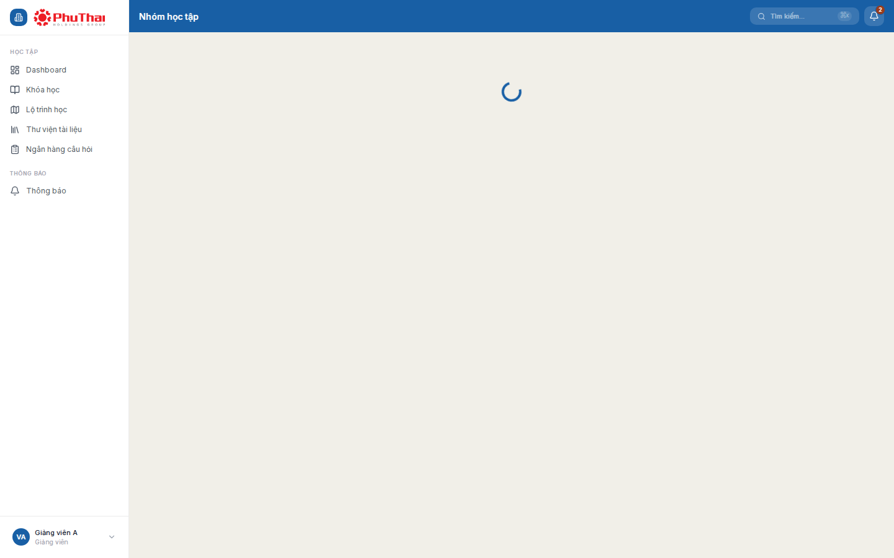


**Thêm thành viên:**

1. Trong trang chi tiết nhóm ➔ tab **Thành viên**.
2. Ô tìm kiếm **MemberSearch** hiển thị ở đầu trang.
3. Gõ tên hoặc email nhân viên vào ô tìm kiếm.
4. Kết quả gợi ý xuất hiện — nhấn chọn nhân viên muốn thêm.
5. Nhân viên được thêm vào danh sách thành viên ngay lập tức.

**Xóa thành viên:**

1. Trong danh sách thành viên, tìm người cần xóa.
2. Nhấn nút **Xóa** (màu đỏ) bên phải tên thành viên.
3. Hộp thoại xác nhận hiện ra — nhấn **Xác nhận**.
4. Thông báo `Đã xóa thành viên` xuất hiện.

---

### 8.3 Nhóm Rule-based (Tự động)

Nhóm Rule-based tự động cập nhật thành viên dựa trên quy tắc định nghĩa trước — không cần thêm/xóa thủ công.

> 📸 **[HÌNH 8.3]** Tab "Cấu hình quy tắc" — RuleBuilder UI với các điều kiện phòng ban, dropdown chọn phòng

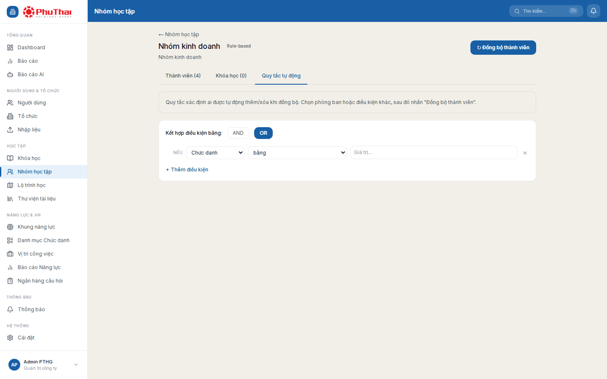

**Cấu hình quy tắc (RuleBuilder):**

1. Trong trang chi tiết nhóm ➔ tab **Quy tắc** (hoặc **Cấu hình**).
2. Giao diện RuleBuilder hiển thị các điều kiện dạng:
   - `Phòng ban` + `bằng` + `[Chọn phòng ban]`
   - Có thể thêm nhiều điều kiện với logic `VÀ` / `HOẶC`
3. Ví dụ cấu hình: Thêm điều kiện `Phòng ban = Phòng Kỹ thuật` HOẶC `Phòng ban = Phòng Vận hành`
4. Nhấn **Lưu quy tắc**.

**Đồng bộ thành viên:**

Sau khi cấu hình quy tắc hoặc khi nhân sự có thay đổi, nhấn nút **Đồng bộ thành viên** ở header trang nhóm.

Hệ thống:
- So sánh nhân viên hiện tại với quy tắc
- Thêm những người thỏa điều kiện chưa có trong nhóm
- Xóa những người không còn thỏa điều kiện
- Thông báo: `Đồng bộ xong: +X thêm, -Y xóa`

> 💡 **Lưu ý:** Đồng bộ không tự động chạy — cần thực hiện thủ công hoặc nhờ Admin cấu hình lịch chạy tự động. Nên đồng bộ sau mỗi đợt biến động nhân sự.

---

### 8.4 Nhóm Ngoài hệ thống (External)

Dùng cho học viên chưa có tài khoản trong LMS — ví dụ: đối tác, nhà thầu, học viên thực tập.

> 📸 **[HÌNH 8.4]** Tab thành viên nhóm External — ô tìm kiếm ExternalMemberSearch, danh sách thành viên với toggle Active/Inactive

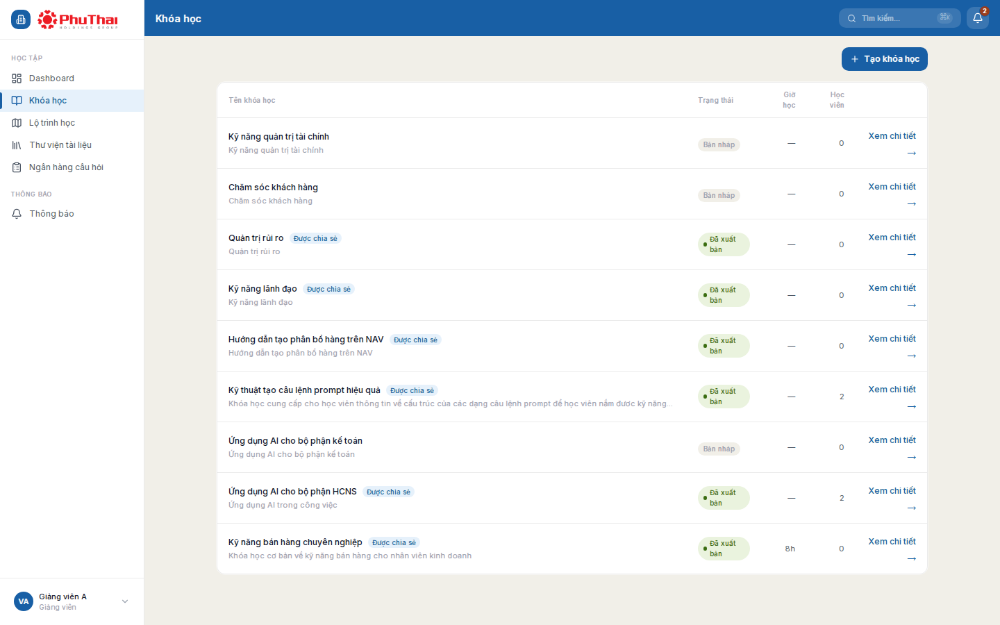


**Thêm thành viên ngoài hệ thống:**

1. Tab **Thành viên** của nhóm External.
2. Ô **ExternalMemberSearch** — nhập email hoặc tên người cần mời.
3. Nếu hệ thống tìm thấy, chọn từ danh sách gợi ý.
4. Nếu không tìm thấy, nhập email mới để gửi lời mời.
5. Nhấn **Thêm**.

**Quản lý trạng thái hoạt động:**

Mỗi thành viên External có toggle **Hoạt động / Không hoạt động**:
- **Hoạt động (Active)**: Thành viên có thể truy cập khóa học của nhóm
- **Không hoạt động (Inactive)**: Tạm khóa quyền truy cập mà không cần xóa khỏi nhóm

Nhấn toggle để chuyển đổi trạng thái.

---

### 8.5 Giao khóa học cho nhóm

Có 2 cách giao khóa học cho nhóm:

**Cách 1: Từ trang nhóm học tập**
1. Trong trang chi tiết nhóm ➔ tab **Khóa học**.
2. Nhấn **+ Thêm khóa học**.
3. Chọn khóa học từ dropdown.
4. Đặt deadline (tùy chọn).
5. Nhấn **Thêm**.

**Cách 2: Từ Course Builder (xem Mục 6.2)**

Khóa học được giao sẽ hiển thị trong tab Khóa học của nhóm, với thông tin deadline và tên người giao.

**Xóa khóa học khỏi nhóm:**
Nhấn nút **Xóa** bên phải tên khóa học ➔ xác nhận.

> ⚠️ **Cảnh báo:** Xóa khóa học khỏi nhóm không xóa tiến độ đã học của các thành viên. Tuy nhiên khóa học sẽ không còn xuất hiện trong danh sách học của họ.

---

### 8.6 Quản lý thành viên nhóm

Trang chi tiết nhóm hiển thị 3 tab:

- **Thành viên**: Danh sách thành viên hiện tại (chỉ tính thành viên chưa bị xóa). Với nhóm External thêm cột trạng thái Active/Inactive.
- **Khóa học**: Danh sách khóa học đã giao cho nhóm
- **Quy tắc** (chỉ nhóm Rule-based): Cấu hình điều kiện tự động

**Thống kê nhanh:** Header trang nhóm hiển thị tổng số thành viên hiện tại.

---

## 9. Khung năng lực

Khung năng lực (Competency Framework) là công cụ định nghĩa cấu trúc năng lực cần thiết cho các vị trí trong tổ chức, kết nối với khóa học đào tạo tương ứng.

**Truy cập:** Menu **Khung năng lực**.

### 9.1 Tổng quan khung năng lực

Cấu trúc phân cấp:

```
Khung năng lực (Framework)
└── Lĩnh vực (Domain)
    └── Năng lực (Competency)
        └── Mức độ 1-5 (Level Descriptions)
            └── Liên kết khóa học
```

Ví dụ:
```
Khung năng lực Quản lý Sản xuất v2.0
├── Lĩnh vực: Kỹ thuật vận hành (Trọng số: 40%)
│   ├── Năng lực: Vận hành máy CNC (Yêu cầu: Cấp 3)
│   └── Năng lực: Đọc bản vẽ kỹ thuật (Yêu cầu: Cấp 4)
└── Lĩnh vực: Quản lý chất lượng (Trọng số: 60%)
    └── Năng lực: Kiểm soát ISO 9001 (Yêu cầu: Cấp 3)
```

---

### 9.2 Tạo khung năng lực mới

1. Trang **Khung năng lực** ➔ nhấn **+ Tạo khung năng lực**.
2. Điền:
   - **Tên khung**: Ví dụ: `Khung năng lực Nhân viên Kinh doanh 2026`
   - **Phiên bản**: Ví dụ: `1.0`
   - **Mô tả**: Phạm vi áp dụng và đối tượng
3. Nhấn **Tạo**.

---

### 9.3 Thêm lĩnh vực (Domain)

1. Trong trang chi tiết khung năng lực, nhấn **+ Thêm lĩnh vực**.
2. Điền:
   - **Tên lĩnh vực**: Ví dụ: `Kỹ năng bán hàng`
   - **Mô tả**: Mô tả phạm vi lĩnh vực
   - **Trọng số (%)**: Tỉ trọng của lĩnh vực trong tổng thể khung (ví dụ: `35`)
3. Nhấn **Lưu**.

> 📸 **[HÌNH 9.3]** Trang chi tiết khung năng lực — danh sách lĩnh vực có thể thu gọn, form thêm lĩnh vực

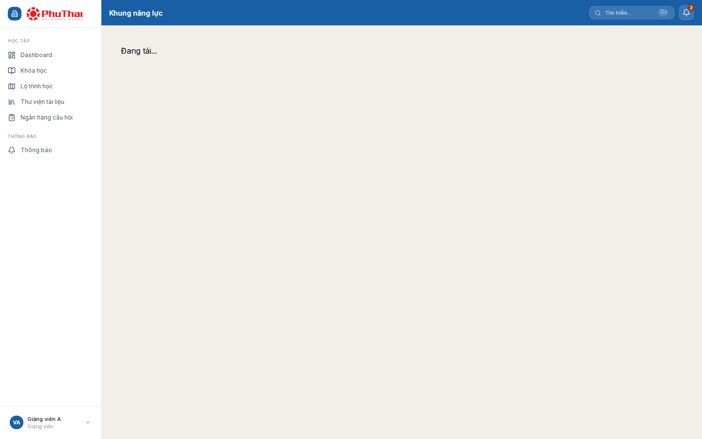


**Xóa lĩnh vực:** Nhấn biểu tượng xóa bên cạnh tên lĩnh vực ➔ xác nhận qua dialog.

---

### 9.4 Thêm năng lực (Competency)

1. Mở rộng lĩnh vực muốn thêm năng lực (nhấn vào tên lĩnh vực).
2. Nhấn **+ Thêm năng lực** trong lĩnh vực đó.
3. Điền:
   - **Tên năng lực**: Ví dụ: `Kỹ năng thương lượng và chốt hợp đồng`
   - **Mô tả**: Mô tả chi tiết năng lực
   - **Cấp độ yêu cầu**: Chọn từ 1-5 (cấp độ tối thiểu cần đạt)
4. Hệ thống tự động tạo mô tả cho từng cấp độ 1-5 (có thể chỉnh sửa thêm).
5. Nhấn **Lưu**.

**Mô tả cấp độ (Level Descriptions):**

Mỗi năng lực có 5 cấp độ:

| Cấp | Mô tả mặc định | Có thể tùy chỉnh thành |
|---|---|---|
| Cấp 1 | Nhận biết, hiểu biết cơ bản | `Biết nguyên tắc cơ bản của đàm phán` |
| Cấp 2 | Áp dụng có hướng dẫn | `Thực hiện được khi có sự hỗ trợ` |
| Cấp 3 | Áp dụng độc lập | `Tự đàm phán hợp đồng nhỏ dưới 100 triệu` |
| Cấp 4 | Thành thạo, hướng dẫn người khác | `Chốt hợp đồng lớn, đào tạo nhân viên mới` |
| Cấp 5 | Chuyên gia, định hướng chiến lược | `Xây dựng chiến lược thương lượng toàn công ty` |

---

### 9.5 Liên kết khóa học với năng lực

Liên kết giúp hệ thống biết khóa học nào giúp học viên đạt được năng lực nào ở cấp độ nào.

1. Trong trang chi tiết năng lực (nhấn vào tên năng lực), tìm phần **Khóa học liên kết**.
2. Nhấn **+ Liên kết khóa học**.
3. Chọn:
   - **Khóa học**: Chọn từ danh sách khóa học đã xuất bản
   - **Cấp độ đạt được**: Học viên hoàn thành khóa này sẽ đạt cấp mấy?
4. Nhấn **Lưu liên kết**.

> 💡 **Lưu ý:** Một năng lực có thể liên kết nhiều khóa học (ví dụ: Cấp 1 dùng khóa nhập môn, Cấp 3 dùng khóa nâng cao). Liên kết này được dùng trong báo cáo năng lực và gợi ý lộ trình học tập.

**Checklist khung năng lực:**
- [ ] Khung có ít nhất 2 lĩnh vực
- [ ] Mỗi lĩnh vực có ít nhất 1 năng lực
- [ ] Cấp độ yêu cầu đã được xác định cho từng năng lực
- [ ] Các khóa học đào tạo chính đã được liên kết với năng lực tương ứng
- [ ] Tổng trọng số các lĩnh vực = 100%

---

## 10. Dashboard & Báo cáo

### 10.1 Dashboard tổng quan

Dashboard hiển thị dữ liệu khác nhau tùy theo vai trò:

**Company Admin / HR Manager** thấy:
- Thống kê nhanh 5 KPI của công ty mình
- Biểu đồ tiến độ học theo khóa học
- Danh sách khóa học gần đây

**Group Admin / Group HRM** thấy thêm:
- So sánh hiệu suất học tập giữa các công ty con
- Biểu đồ completionRate từng công ty
- Học viên hoạt động trong 30 ngày qua

---

### 10.2 Chỉ số KPI

Truy cập **Báo cáo** (`/reports`) để xem chi tiết.

**KPI cho Company Admin:**

| Chỉ số | Công thức | Mức tốt |
|---|---|---|
| **Tỉ lệ hoàn thành** | Số enrollment đã Complete / Tổng enrollment | ≥ 70% |
| **Tuân thủ bắt buộc** | Nhân viên hoàn thành đúng hạn khóa bắt buộc / Tổng bắt buộc | ≥ 90% |
| **Lượt đăng ký** | Tổng số lần nhân viên được giao/tự đăng ký | Tăng liên tục |

**KPI cho Group Admin:**

| Chỉ số | Ý nghĩa |
|---|---|
| **Hoàn thành TB** | Trung bình tỉ lệ hoàn thành của tất cả công ty |
| **Học viên hoạt động (30 ngày)** | Số nhân viên đã có hoạt động học tập trong 30 ngày qua |

---

### 10.3 Báo cáo theo phòng ban

> 📸 **[HÌNH 10.3]** Bảng báo cáo theo phòng ban — cột tên phòng ban, số nhân viên, lượt đăng ký, đã hoàn thành, tỉ lệ hoàn thành

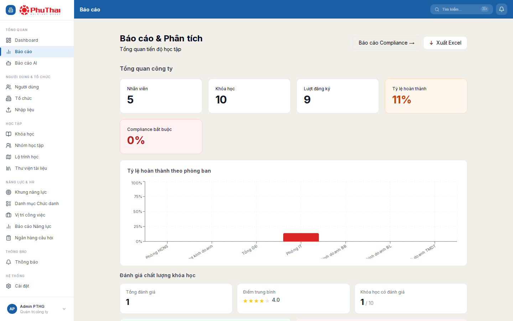


Bảng phân tích hiệu suất từng phòng ban, mỗi dòng gồm:
- **Tên phòng ban**
- **Số nhân viên**
- **Lượt đăng ký** (tổng khóa học được giao)
- **Đã hoàn thành**
- **Tỉ lệ hoàn thành** (%)

Sử dụng để xác định phòng ban nào cần hỗ trợ thêm hoặc có tiến độ học tốt.

---

### 10.4 Báo cáo chất lượng khóa học

Phần **Đánh giá & Chất lượng** hiển thị:

**Tổng quan đánh giá:**
- Tổng số đánh giá toàn hệ thống
- Điểm trung bình (Average Rating) hiển thị dạng sao ★
- Số khóa học đã được đánh giá / tổng khóa học

**Top khóa học được đánh giá cao:**
- Danh sách top khóa học với điểm đánh giá cao nhất
- Mỗi khóa hiển thị: tên, điểm sao, số lượt đánh giá

**Khóa học cần cải thiện (Bottom-rated):**
- Khóa học có điểm đánh giá thấp nhất
- Đây là tín hiệu cần xem xét lại nội dung hoặc chất lượng giảng dạy

> 📸 **[HÌNH 10.4]** Phần đánh giá — card tổng quan + danh sách top/bottom rated với sao vàng


---

### 10.5 Báo cáo Compliance

Báo cáo Compliance theo dõi việc hoàn thành các khóa học **bắt buộc** đúng hạn.

**Truy cập:** Trang Báo cáo ➔ nhấn **Báo cáo Compliance →**.

Báo cáo hiển thị:
- Danh sách nhân viên chưa hoàn thành khóa bắt buộc
- Khóa học bắt buộc nào đã quá hạn
- Tỉ lệ compliance theo phòng ban
- Lọc theo: Phòng ban / Khóa học / Khoảng thời gian

**Cách dùng để nhắc nhở học viên:**
1. Lọc theo phòng ban + trạng thái "Chưa hoàn thành"
2. Xuất danh sách (xem Mục 10.6)
3. Gửi danh sách cho trưởng phòng để nhắc nhở trực tiếp

---

### 10.6 Xuất báo cáo

Dữ liệu báo cáo có thể xuất ra file để lưu trữ hoặc trình bày.

**Cách xuất:**

1. Trong trang **Báo cáo**, tìm nút **Xuất báo cáo** (ExportButton) góc trên phải.
2. Nhấn nút ➔ hệ thống chuẩn bị file.
3. File tự động tải về máy tính (định dạng Excel `.xlsx` hoặc CSV).

> 💡 **Lưu ý:** Chỉ Company Admin và HR Manager mới thấy nút Xuất báo cáo. Group Admin xem báo cáo tổng hợp nhưng không xuất dữ liệu chi tiết từng công ty.

> ⚠️ **Cảnh báo:** File báo cáo chứa dữ liệu cá nhân (tên, email, tiến độ học). Không chia sẻ ra ngoài tổ chức khi chưa được phép của bộ phận pháp lý.

**Checklist báo cáo hàng tháng:**
- [ ] Kiểm tra tỉ lệ hoàn thành tổng thể so với tháng trước
- [ ] Xác định phòng ban có tỉ lệ thấp nhất để có kế hoạch hỗ trợ
- [ ] Xem Compliance Report — nhắc nhở nhân viên quá hạn
- [ ] Kiểm tra đánh giá khóa học — xem xét cải thiện khóa có điểm thấp
- [ ] Xuất và lưu báo cáo tháng vào thư mục lưu trữ nội bộ

---

## 11. Phụ lục

### Phụ lục A: Bảng phím tắt

| Phím tắt | Ngữ cảnh | Hành động |
|---|---|---|
| **Enter** | Ô nhập tên chương/bài học | Lưu ngay lập tức |
| **Escape** | Chế độ chỉnh sửa inline | Hủy chỉnh sửa, giữ nguyên dữ liệu cũ |
| **Enter** | Ô nhập tên chương mới | Thêm chương |
| **Tab** | Các ô nhập liệu trong form | Chuyển sang trường tiếp theo |

---

### Phụ lục B: Định dạng file CSV câu hỏi

File CSV cần có hàng đầu tiên là tiêu đề cột (header). Encoding: **UTF-8**.

**Các cột bắt buộc:**

| Cột | Kiểu dữ liệu | Giá trị hợp lệ | Ghi chú |
|---|---|---|---|
| `question` | Text | Bất kỳ | Nội dung câu hỏi |
| `type` | Enum | `single_choice` / `true_false` / `fill_blank` | Loại câu hỏi |
| `option_a` | Text | Bất kỳ | Đáp án A (bắt buộc với single_choice) |
| `option_b` | Text | Bất kỳ | Đáp án B |
| `option_c` | Text | Bất kỳ | Đáp án C (bỏ trống nếu không dùng) |
| `option_d` | Text | Bất kỳ | Đáp án D (bỏ trống nếu không dùng) |
| `correct_answer` | Text | `A`/`B`/`C`/`D` hoặc `true`/`false` hoặc text | Đáp án đúng |
| `difficulty` | Enum | `easy` / `medium` / `hard` | Độ khó |
| `explanation` | Text | Bất kỳ | Giải thích (tùy chọn) |
| `points` | Integer | Số nguyên dương | Điểm số (mặc định: 1) |

**Ví dụ một dòng dữ liệu:**

```
"Thời gian nghỉ phép năm tối thiểu theo luật VN là bao nhiêu ngày?","single_choice","10 ngày","12 ngày","14 ngày","20 ngày","B","easy","Theo BLLĐ 2019 Điều 113: tối thiểu 12 ngày làm việc","1"
```

**Lưu ý khi tạo file CSV:**
- Nếu nội dung có dấu phẩy, bọc trong dấu ngoặc kép `"..."`
- Nếu nội dung có dấu ngoặc kép, dùng hai dấu `""` để thoát
- Không để ô trống ở cột bắt buộc
- Kiểm tra file bằng cách mở với Notepad trước khi import để đảm bảo encoding UTF-8

---

### Phụ lục C: Vai trò và quyền hạn

| Chức năng | Instructor | HR Manager | Company Admin | Group HRM | Group Admin |
|---|---|---|---|---|---|
| Tạo khóa học | ✓ | ✓ | ✓ | ✓ | ✓ |
| Xuất bản khóa học | ✓ | ✓ | ✓ | ✓ | ✓ |
| Giao khóa học (Phòng ban) | — | ✓ | ✓ | — | — |
| Giao khóa học (Cá nhân) | — | ✓ | ✓ | ✓ | ✓ |
| Giao cho Nhóm học tập | — | — | ✓ | ✓ | ✓ |
| Chia sẻ xuyên công ty | — | — | — | ✓ | ✓ |
| Tạo Nhóm học tập | — | ✓ | ✓ | ✓ | ✓ |
| Tạo Lộ trình học tập | — | ✓ | ✓ | ✓ | ✓ |
| Xem báo cáo công ty | — | ✓ | ✓ | — | — |
| Xem báo cáo toàn tập đoàn | — | — | — | ✓ | ✓ |
| Quản lý Khung năng lực | — | ✓ | ✓ | ✓ | ✓ |
| Quản lý Ngân hàng câu hỏi | ✓ | ✓ | ✓ | ✓ | ✓ |
| Duyệt câu hỏi AI | ✓ | ✓ | ✓ | ✓ | ✓ |

*Ký hiệu: ✓ = Có quyền, — = Không có quyền*

---

### Phụ lục D: Xử lý sự cố thường gặp

**D.1 Không thấy menu "Khóa học" hoặc "Báo cáo"**

*Nguyên nhân:* Tài khoản chưa được gán vai trò phù hợp.  
*Giải pháp:* Liên hệ quản trị viên hệ thống (Group Admin) để cấp vai trò `hr_manager` hoặc `instructor`.

---

**D.2 Nút "Xuất bản" không xuất hiện**

*Nguyên nhân có thể:*
- Khóa học đã ở trạng thái "Đã xuất bản" (nút không hiển thị nữa)
- Có bài học ở trạng thái ✗ hoặc ⏳ chưa xử lý xong

*Giải pháp:*
1. Kiểm tra thanh trạng thái tổng hợp góc trên phải vùng bài học
2. Upload nội dung cho các bài ✗
3. Chờ các bài ⏳ xử lý xong (có thể vài phút)
4. Kiểm tra lại — nút Xuất bản xuất hiện khi tất cả bài ✓

---

**D.3 Import CSV báo lỗi**

*Nguyên nhân thường gặp:*
- File không phải encoding UTF-8 (lỗi ký tự tiếng Việt)
- Thiếu cột bắt buộc
- Giá trị cột `type` hoặc `difficulty` không đúng enum

*Giải pháp:*
1. Tải lại file mẫu từ hệ thống (↓ Mẫu CSV) — không tự tạo template
2. Lưu file dưới dạng **CSV UTF-8** trong Excel (không phải CSV thông thường)
3. Kiểm tra các cột `type` và `difficulty` phải viết thường, đúng chính xác như đặc tả

---

**D.4 AI không tạo được Outline (Course Wizard)**

*Nguyên nhân:* AI Service tạm thời không hoạt động.  
*Giải pháp:*
1. Chờ 2-3 phút rồi thử lại bằng nút **Tạo lại**
2. Nếu vẫn lỗi, liên hệ IT để kiểm tra trạng thái AI Service
3. Trong thời gian chờ, tạo khóa học thủ công theo Mục 3

---

**D.5 Học viên không thấy khóa học sau khi giao**

*Kiểm tra lần lượt:*
1. Khóa học đã được **xuất bản** chưa? (Badge phải là `● Đã xuất bản`)
2. Đã giao đúng đối tượng chưa? (Kiểm tra Lịch sử giao học trong tab Phân phối)
3. Học viên thuộc đúng phòng ban / nhóm được giao không?
4. Nếu giao qua Nhóm Rule-based — đã nhấn **Đồng bộ thành viên** chưa?

---

**D.6 Không thể xóa danh mục câu hỏi**

*Nguyên nhân:* Danh mục đang chứa câu hỏi.  
*Giải pháp:* Chuyển tất cả câu hỏi trong danh mục sang danh mục khác trước, sau đó xóa.

---

**D.7 Hình ảnh bìa không hiển thị sau khi upload**

*Nguyên nhân:* File ảnh quá lớn hoặc định dạng không được hỗ trợ.  
*Giải pháp:*
- Chỉ dùng định dạng: JPEG, PNG, WebP, GIF
- Nén ảnh về dưới 5MB trước khi upload
- Thử làm mới trang (F5) sau khi upload thành công

---

*Tài liệu được cập nhật và duy trì bởi Bộ phận Đào tạo & Phát triển.*  
*Góp ý và báo lỗi: gửi về hòm thư quản trị LMS hoặc mở ticket trong hệ thống hỗ trợ nội bộ.*
